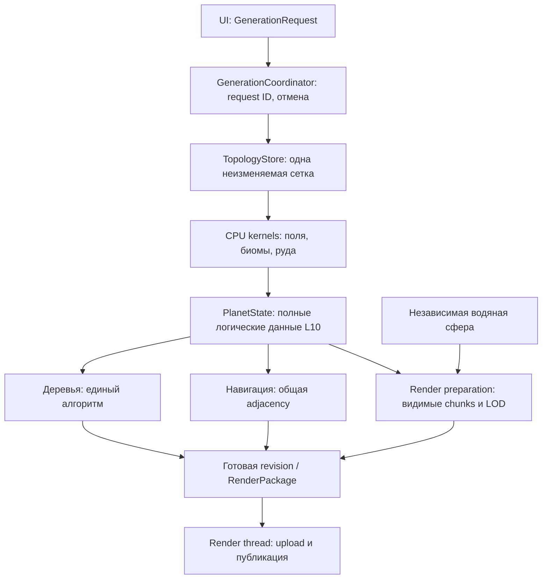

# Legacy и DAG — анализ и архитектура для L10

Дата анализа: 2026-10-09. Основание: текущие исходники приложения и встроенной библиотеки ProcessDAG. Новые замеры в рамках этого анализа не выполнялись; численные результаты взяты из [аудита производительности L10](../Эксплуатация/Аудит%20производительности%20—%20цель%20L10%20за%201–2%20секунды.md) и [baseline 2026-10-07](../../benchmarks/2026-10-07/README.md). Предложения ниже ещё не реализованы.

## Основной вывод

**Архитектурные изменения способны убрать большой объём лишней работы. Основное направление — единые данные планеты, общая сетка, расчёт только зависимых результатов и ограниченная геометрия отображения. Простая смена DAG на Legacy не решает L10.**

Legacy сейчас дешевле передаёт данные и лучше переиспользует живую модель, но связывает расчёты с контроллером сцены. DAG явно описывает зависимости и умеет запрашивать отдельные результаты, но текущая интеграция многократно восстанавливает модель из JSON и частично повторяет Legacy-вычисления. Проект фактически использует смесь двух подходов.

Рекомендация: выделить общее вычислительное ядро с обычными C++ структурами, сделать одного владельца опубликованной версии планеты, а DAG использовать как необязательный слой управления крупными задачами. Сначала получить прямой последовательный путь через это ядро, затем сравнить его с DAG над теми же функциями и данными. Тогда сравниваться будет цена управления задачами, а не два разных набора вычислений.

## 1. Что именно называется Legacy и DAG

В [TerrainBackendSelector.h](../../../dag/TerrainBackendSelector.h) выбран `DagTerrainBackend`. Это compile-time alias: переключения через UI нет. `TerrainBackend` concept из [TerrainBackendContract.h](../../../dag/TerrainBackendContract.h) проверяет наличие методов, но не одинаковый смысл их работы.

В [EngineFacade.cpp](../../../dag/EngineFacade.cpp), `EngineFacade::Impl`, одновременно существуют:

| Компонент | Реальная роль | Время жизни |
|---|---|---|
| `SelectedTerrainBackend` | Генерация рельефа и руды | Backend живёт с facade |
| `DagPathBackend` | Подготовка входов и запуск обычного `PathBuilder` | Постоянный DAG engine |
| `DagSceneBackend` | Selection outline, деревья, позиции моделей | Постоянный DAG engine |
| `HexSphereSceneController` | Живая модель, сетка, меши, вода, локальная расстановка деревьев | Живёт с контроллером ввода |
| `HexSphereRenderer` | GPU-ресурсы, atlas, chunk layout и рисование | Живёт в UI/render части |

**Замена alias на `LegacyTerrainBackend` меняет только terrain.** Path и Scene DAG остаются. Это не переключатель между двумя полностью независимыми архитектурами приложения.

Кроме класса `LegacyTerrainBackend`, словом legacy иногда называют прямые CPU-функции: генераторы, `PathBuilder`, `SelectionOutlineGenerator`, методы scene controller. Многие из них используются и внутри DAG. Поэтому фраза «DAG медленнее Legacy» без указания конкретного пути и набора работы неоднозначна.

## 2. Как проходит генерация в каждом варианте

### 2.1. Legacy: вычисление прямо в живой сцене

Основные файлы: [LegacyTerrainBackend.cpp](../../../dag/LegacyTerrainBackend.cpp), [HexSphereSceneController.cpp](../../../controllers/HexSphereSceneController.cpp).

```text
LegacyTerrainBackend::set...()
  → bridge.stage...()
  → captureTerrainSnapshot() → копия snapshot в backend

LegacyTerrainBackend::regenerateTerrain()
  → bridge.rebuildTerrainFromInputs()
    → SceneController::rebuildTerrainFromInputs()
      → при topologyDirty_: rebuildModel() → rebuildTopology()
      → regenerateTerrain(): generator + ore на одной model_
      → updateTerrainMesh() + generateTreePlacements()
  → captureTerrainSnapshot() → копия snapshot в backend
```

Если subdivision не менялся, `topologyDirty_` не требует новой сетки. Рельеф и руда обрабатывают одну живую `model_`. Это реальное преимущество: нет промежуточной текстовой упаковки между ними и нет обязательной второй модели для ore.

Но каждый setter вызывает `syncFromAdapter()`: даже изменение одного параметра захватывает полный snapshot клеток. Пока генерация ещё не выполнена, staged параметры могут уже быть новыми, а значения клеток — старыми. Такой snapshot нельзя безоговорочно трактовать как завершённую версию планеты.

После terrain общий UI-путь всё равно вызывает `uploadBuffers()` с Scene DAG, atlas и GPU upload. Legacy не устраняет эти расходы.

### 2.2. DAG terrain: два вычислительных узла и последующая проекция

Основной файл: [DagTerrainBackend.cpp](../../../dag/DagTerrainBackend.cpp).

```text
set...() → сохранить параметры только в backend
regenerateTerrain()
  → Impl::regenerateViaDag()
    → создать новый DefaultDagEngine, init(inputs)
    → TerrainBuild: новая сетка + модель + generator → base snapshot JSON
    → OreBuild: разобрать JSON → новая сетка + модель + ore → final JSON
    → разобрать final JSON → ack_outputs()
  → сохранить currentSnapshot
  → bridge.projectTerrainSnapshot()
    → новая сетка живой сцены + water proxy
    → копирование клеток + terrain mesh + локальные trees
    → path snapshot sync
```

Схема и registry сохраняются в `Impl`, но **сам `DefaultDagEngine` создаётся локально внутри `regenerateViaDag()` при каждом вызове**. Его результаты и кэш планов не переиспользуются между генерациями. Простое повторение того же seed здесь не превращается в дешёвый terrain cache hit.

Узлов всего два, они строго зависят друг от друга. Такой граф хорошо обозначает этапы, но пока не создаёт возможностей для параллельного исполнения этих двух этапов.

### 2.3. После terrain остаются общие затраты

[InputController.cpp](../../../controllers/InputController.cpp), `uploadBuffers()` → `refreshSceneDagOutputs()` → `renderer_->uploadScene(...)`:

- Scene DAG снова получает полный snapshot и на новых входах строит trees/models через новые модели планеты.
- В живой сцене деревья уже были вычислены; обычный путь затем заменяет список результатом Scene DAG.
- `result.modelPlacements` не применяется в `refreshSceneDagOutputs()`. Позиции сущностей обновляются другим путём: `refreshEntityTransformsForTerrain()` → `computeSurfacePoint(...)`.
- Renderer загружает terrain, строит chunks и surface atlas, загружает воду.

Следовательно, DAG-расчёт model placements сейчас не просто дорогой: в этой runtime-цепочке он не даёт используемого результата. Сначала следует определить одного владельца размещения сущностей и убрать второй вычислительный путь из запроса. Публичный API/тестовый сценарий могут оставаться, если у них есть отдельные потребители.

Связь с аудитом: **P0.1–P0.5, P1.3, P1.5, P1.6**.

## 3. Что на самом деле умеет ProcessDAG

Проверены [DagEngine.inl](../../../third_party/ProcessDAG/DAG/DagEngine.inl), [Executor.h](../../../third_party/ProcessDAG/DAG/Executor.h), [DagStorage.h](../../../third_party/ProcessDAG/DAG/DagStorage.h), [StateTypes.h](../../../third_party/ProcessDAG/DAG/StateTypes.h), [MemoryPolicy.h](../../../third_party/ProcessDAG/DAG/MemoryPolicy.h).

| Механизм | Что есть сейчас | Что это не означает |
|---|---|---|
| Explicit requested outputs | `flush_prepare(outputs)` строит план под запрошенные выходы | Не означает автоматическое разбиение больших массивов на клетки/чанки |
| Dirty inputs и guards | Можно не исполнять ненужные узлы | Формирование входного JSON и сравнение ключей уже могли произойти до skip |
| Plan cache | Повторно использует план по набору changed fields и outputs | Это кэш порядка работы, не кэш готовой планеты |
| Persistent outputs | Результаты могут пережить следующий запуск постоянного engine | Terrain engine сейчас пересоздаётся, поэтому это преимущество там теряется |
| Prepare/ack и abort | Есть подготовка выходов, подтверждение и откат внутренней работы engine при ошибке | Нет общей транзакции над scene, ECS, GPU и кэшами приложения |
| Handles | `ValueRef = shared_ptr<const std::string>`; копирование handle разделяет строку | `set_handle` пока не принимает произвольный `shared_ptr<TerrainState>` |
| Executor | Идёт по `plan.topo` и синхронно вызывает `operations.execute(...)` | Независимые узлы автоматически не запускаются на разных ядрах |

Важная поправка к упрощённому объяснению расходов: **не каждый внутренний переход ProcessDAG копирует весь JSON**. `DefaultMemoryPolicy::duplicate()` возвращает тот же shared handle. Но адаптеры приложения вызывают сериализацию, `toStdString()`, создают строковые ключи и через `readStringField()` делают новые строки. Именно эти места нужно измерять и удалять. Сравнение значений в стандартной memory policy использует содержимое строк; сравнение идентичности низкоуровневых handles — отдельный механизм.

Название типа поля `int` или `scalar` в схеме не отменяет строковый runtime payload: адаптеры читают его через `Commit::debug_view()` и парсят. Переход на typed payload потребует изменения контрактов библиотеки, а не одной замены вызова `set()` на `set_handle()`.

## 4. Преимущества и недостатки Legacy в этом проекте

| Преимущество | Почему полезно | Ограничение |
|---|---|---|
| Прямые вызовы и обычные C++ данные | Меньше преобразований и промежуточных объектов | Сложность генераторов и объём geometry остаются |
| Одна живая модель для terrain/ore | Не нужно повторно строить topology между этапами | Модель содержит лишние для части задач wire/picking данные |
| Сетка сохраняется при том же уровне | Повторный seed не требует rebuild topology сцены | Derived mesh/trees всё равно пересчитываются |
| Понятный последовательный поток | Проще отладить, профилировать и локально изменить | Зависимости между этапами не выражены отдельным контрактом |
| Реальные рабочие генераторы | Можно использовать как основу общего ядра | Это не эталон абсолютной корректности; нужны проверки |

| Недостаток | Где проявляется | Архитектурное последствие |
|---|---|---|
| Зависимость от живой сцены | `ITerrainSceneBridge::rebuildTerrainFromInputs()` | Backend без bridge работать не может; headless benchmark тоже создаёт scene controller |
| Изменение модели на месте | `HexSphereSceneController::regenerateTerrain()` | Фоновая генерация может конфликтовать с чтением текущей сцены; нельзя просто вынести существующий вызов в thread |
| Монолитные производные данные | `updateTerrainMesh()`, `generateTreePlacements()` | Изменение одной клетки запускает широкую обработку |
| Скрытая стоимость setter-ов | `set...()` → `syncFromAdapter()` | Копирование всех клеток ради изменения маленького параметра |
| Смешение staged и committed состояния | Snapshot захватывается до regeneration | API не отделяет «параметры будущего запроса» от «готовой планеты» |
| Нет явного механизма публикации/отмены | Модель мутируется по ходу расчёта | Труднее сохранить старую рабочую сцену при ошибке или отмене |
| Часть логики дублируется DAG-веткой | Два генератора tree placements | Исправления могут расходиться; одинаковый seed не гарантирует одинаковую сцену |

Legacy — хорошая база для выделения вычислительных функций. Возврат к существующему классу целиком сохраняет его сцепление с UI/scene и не создаёт архитектуру для L10.

## 5. Преимущества и недостатки DAG в этом проекте

| Преимущество | Где уже есть польза |
|---|---|
| Явные входы, выходы и зависимости | Схемы terrain/scene/path показывают назначение этапов |
| Запрос только нужного результата | Selection запрашивает `selectionOutline/selectionSuccess`, не trees/models |
| Пропуск вычислений на неизменных входах | Guards и persistent outputs в Scene DAG |
| Повторное использование результатов | `treeCache` / `modelCache` при возврате к прежнему ключу, хотя формат и eviction требуют исправления |
| Управляемая граница операции | Executor возвращает commit, engine умеет prepare/ack/abort |
| Диагностика | Статистика executed/skipped nodes, plan/cache hits, input bytes |
| Возможность развития | После нормализации данных зависимости помогут выбирать только затронутые stages/chunks |

| Недостаток текущей интеграции | Конкретная причина | Связь с аудитом |
|---|---|---|
| Многократное восстановление планеты | Узлы получают snapshot вместо общей topology/state | P0.1, P1.2 |
| Полные JSON на горячем пути | Строковая передача и разбор больших буферов | P0.3 |
| Потеря переиспользования terrain | Новый engine на каждый `regenerateViaDag()` | P0.1–P0.3 |
| Слишком крупные зависимости | Trees/models зависят от целого `terrainSnapshot` | P0.3, P1.3 |
| Дорогой даже cache hit | Сначала `serializeTerrainSnapshot()`, затем full-string keys | P0.3 |
| Рост памяти | Кэши удерживают ключи-снимки и результаты без лимита | P0.3 |
| Работа без потребителя | Runtime игнорирует `modelPlacements` | P1.3 |
| Нет автоматического параллелизма | Синхронный цикл в `Executor::run()` | P1.4 |
| Зависимость от scene всё ещё есть | `DagTerrainBackend::regenerateTerrain()` требует bridge и выполняет projection | P0.2, P2.1 |
| Два источника состояния | Backend snapshot и независимо изменяемая scene model | Нужен единый владелец revision |
| Ограниченная обработка ошибок на уровне приложения | У `SceneDagResult` нет отдельного success/error; пустой результат неоднозначен | Риск устаревших/частично применённых данных |

**Хороший пример — selection.** Он получает маленький `SelectionOutlineInput`, подготовленный из нужных рёбер живой модели; не восстанавливает всю планету и не требует общего scene request. Это показывает, что правильная граница данных может дать выигрыш при сохранении DAG. JSON нескольких рёбер и JSON миллионов клеток имеют принципиально разную стоимость; не нужно начинать с замены самого маленького сообщения.

## 6. Проблемы согласованности, важные для оптимизации

### 6.1. Нет одного надёжного владельца актуального состояния

В обычной работе присутствуют `DagTerrainBackend::currentSnapshot`, изменяемая `scene_.modelMutable()`, строковый snapshot внутри path engine и snapshot/результаты Scene DAG.

В [InputController.cpp](../../../controllers/InputController.cpp) локальная правка высоты/биома меняет scene model, затем `rebuildDerivedGeometry()` обновляет меши, path и scene outputs. Обновления `DagTerrainBackend::currentSnapshot` на этом пути нет. Значит, «текущий snapshot backend» может означать последний результат процедурной генерации, а не текущую отредактированную планету. Само по себе это не доказывает ошибку изображения, но API нужно сделать однозначным до добавления фоновых задач и revision caches.

Также path snapshot передаётся дважды при DAG regeneration: через `InputController::projectTerrainSnapshot()` → `syncPathBackendFromScene()` и затем через `EngineFacade::regenerateTerrain()`. Оба пути сериализуют данные. Это пересечение ответственности контроллера и facade; аудит **P0.3** описывает цепочку.

### 6.2. Контракт одинаковый по форме, но разный по смыслу

Legacy setter меняет staged scene и захватывает snapshot; DAG setter только меняет поля backend. Concept проверяет сигнатуры, не эти эффекты. Предлагается единый `GenerationRequest` и один вызов `build(request)`, без серии setter-ов с побочными действиями.

Есть и конкретный риск числовой границы: seed хранится как `uint32_t`, но DAG пишет его десятичной строкой и читает через `readIntField()` / `QString::toInt()`. Для seed выше `INT_MAX` такое чтение не успешно и применяется fallback. Legacy передаёт исходный `uint32_t` напрямую. Это вывод из кода, отдельно не проверенный запуском на граничных seed; нужен тест 0 / INT_MAX / INT_MAX+1 / UINT32_MAX. Typed request позволит выразить диапазон явно.

### 6.3. Деревья — две разные реализации, а не просто две оболочки

`HexSphereSceneController::generateTreePlacements()` использует общий `mt19937` для последовательности клеток и случайные варианты цветов. `DagSceneBackend::buildTreePlacements()` создаёт RNG из seed и cell ID для каждой клетки и иначе задаёт часть атрибутов. Поэтому удаление одной реализации может изменить расстановку и внешний вид.

Для параллельной обработки удобнее независимый seed клетки, но нужно выбрать канонические правила и явно зафиксировать изменение результата, если оно допускается. Инициализация большого RNG на каждой клетке сама тоже кандидат на профилирование, не доказанный главный bottleneck.

### 6.4. Prepare/ack библиотеки не делает всю смену планеты атомарной

Terrain DAG подтверждает внутренние outputs до последующей проекции в scene. `currentSnapshot` сохраняется перед `projectTerrainSnapshot()`. Если последующие mesh/upload операции не завершаются, нет общей транзакции для backend, scene, ECS и GPU.

Scene backend обновляет `lastTreeKey/lastModelKey` до `flush_prepare()`, а его внешние caches живут вне storage rollback. При исключении возвращается пустой `SceneDagResult`; пустой успешный результат отдельно не обозначен. В контроллере пустой список деревьев не всегда заменяет уже непустой. Это риски retry/публикации, которые следует проверить fault-injection тестами, а не считать решёнными наличием DAG.

Нужны явные `success/error/cancelled`, номер запроса и публикация завершённого результата одной версии. Успех пустого результата должен отличаться от ошибки.

## 7. Что говорят измерения — и чего они не доказывают

Из [аудита](../Эксплуатация/Аудит%20производительности%20—%20цель%20L10%20за%201–2%20секунды.md): Release GUI L6 имеет медиану **5,741 с**, включая вызовы upload, но без отдельного first-present таймера.

| Измеренная стадия L6, медиана | Время | Архитектурное направление |
|---|---:|---|
| Terrain DAG | 1,251 с | Общая topology/state, убрать промежуточный JSON/reconstruction |
| Projection с path sync | 1,179 с | Публиковать готовые данные, убрать rebuild и двойной sync |
| Scene DAG | 1,151 с | Один tree generator, отключить ненужный model output, узкие зависимости |
| Atlas | 1,311 с | Ограничить объём geometry/input, сохранить BVH |
| Terrain upload + CPU chunks | 0,376 с | Chunk ownership из topology, меньше buffers, отложенная подготовка |

Это медианы отдельных стадий, их нельзя трактовать как точный разбор одного запуска. В terrain/scene DAG входят полезные вычисления; нельзя обещать вернуть все эти секунды простым удалением планировщика.

Существующий backend benchmark даёт для первых запросов climate L2 DAG 10,067 мс против Legacy 3,247 мс; perlin L3 — 36,159 против 16,161 мс. Это подтверждает более дорогой текущий путь, но **не даёт коэффициент ускорения полного GUI и не прогнозирует L10**.

Дополнительные ограничения benchmark, выявленные при чтении [DagBackendBenchmark.cpp](../../../dag/DagBackendBenchmark.cpp):

- `runTerrainOnce()` вызывает setter-ы до старта таймера. Скрытые snapshot copies Legacy setter-ов в elapsed не входят.
- `runLegacySceneDerived()` создаёт scene controller, вызывает `applyTerrainSnapshot()` с полной геометрией и деревьями, затем ещё раз `generateTreePlacements()`. DAG scene измеряется на другом объёме работ. Это не чистое сравнение двух способов управления одной задачей.
- Terrain compatibility проверяет только первые 32 клетки; scene compatibility не сравнивает содержимое placements. `compatible=1` не доказывает полную эквивалентность.
- Повторный terrain запрос не использует долгоживущий terrain engine; scene/path устроены иначе. Кэш-поведение нельзя обобщать на все три backend.

Для честного сравнения нужны один набор функций/данных, одинаковая граница таймера, cold/warm/new-seed/cache-hit отдельно и проверка всего результата.

## 8. Варианты архитектуры

| Вариант | Выигрыш | Цена и недостатки | Решение |
|---|---|---|---|
| Просто переключить terrain alias на Legacy | Убирает часть terrain JSON/reconstruction уже сейчас | Scene/Path DAG, geometry explosion и связь с живой сценой остаются; результаты/семантика отличаются | Допустим как отдельный эксперимент, не как целевая архитектура |
| Сохранить всё и добавить threads | Может ускорить некоторые CPU-циклы | Дублирование и огромная память сохраняются; общий mutable state мешает безопасности | Не начинать с этого |
| Только долгоживущий terrain engine | Поможет повторам и будущей invalidation | Новый level/seed всё равно пересчитывает крупные узлы; JSON/mesh не исчезают | Полезный шаг после исправления контрактов |
| Общее typed CPU-ядро + прямой coordinator | Простые данные, один владелец, легко измерить расходы | Зависимости/инвалидацию надо поддерживать явно | Рекомендуемая основа и контрольный путь |
| То же ядро + DAG управления крупными этапами | Выбор нужных результатов и переиспользование без дублирования алгоритмов | Потребуется typed payload или object store; сложнее lifetime/ошибки | Рекомендуемое развитие при доказанной пользе |
| Новый полноценный parallel DAG scheduler | Может исполнять независимые ветви | Дорогое изменение ProcessDAG, merge/rollback/races; два terrain-узла сами по себе не распараллелятся | Отложить до профиля общего ядра |

## 9. Предлагаемая структура

Названия ниже — проект интерфейсов, пока таких типов в приложении нет.



DAG, если сохраняется, управляет зависимостями этих крупных операций. Внутри операции клетки обрабатываются группами в ограниченном пуле. Не создавать DAG-node или отдельную задачу на каждую из 10,5 млн клеток. Не превращать фоновые workers в пользователей живого UI/ECS/OpenGL-контекста.

### 9.1. Разделить данные по сроку жизни

| Предлагаемые данные | Содержимое | Когда менять |
|---|---|---|
| `PlanetTopology` | Directions, ordered adjacency, cell IDs, chunk ownership | При смене уровня/версии алгоритма сетки |
| `TerrainFields` | Height, biome, climate | При изменении генератора/seed/параметров или edit |
| `OreField` | Тип и плотность руды | При изменении его реальных входов |
| `PlanetState` | Shared topology + immutable buffers + revision | Один согласованный результат запроса |
| `RenderPackage` | Нужные mesh/atlas/instance buffers, bounds | По изменениям состояния и выбранного render LOD |
| `NavigationView` | Доступ к neighbors и полям проходимости | По revision нужных полей, без копии полной модели |

На время построения буферами владеет задача и пишет в них без копирования. После завершения они становятся неизменяемыми и разделяются читателями. Immutability не означает копирование всех массивов для каждой стадии. Для локальных изменений возможны блоки с копированием только изменённых частей; это отдельная сложность, не обязательная первая реализация.

`HexSphereModel` на переходном этапе может быть представлением над topology/state для старых потребителей. Однако текущие mutable `Cell` helpers нельзя незаметно заставить менять общую неизменяемую сетку.

### 9.2. Зависимости должны соответствовать данным, которые реально читаются

| Изменение | Что должно пересчитаться | Что должно сохраниться |
|---|---|---|
| Новый subdivision | Topology и зависящее от неё состояние/представление | Независимые ресурсы воды/моделей, если их качество подходит |
| Новый seed того же уровня | Поля, ore, trees, нужные derived results | Topology, IDs, adjacency |
| Только ore params | Ore и его визуальные атрибуты | Климат, topology, path при нынешних правилах, trees |
| Только selection | Outline выбранных рёбер | Terrain, ore, trees, навигация |
| Новые start/goal | Поиск по готовой navigation view | Topology и подготовленные данные проходимости |
| Только optical water params | Uniforms/материалы | Topology, fields, terrain geometry |
| Камера | Visibility и выбор render LOD | Полное логическое состояние планеты |

Поля, которые влияют на соседей, берег или связность, требуют расширения области изменения. Например, coastal distance может распространяться дальше одной клетки. Нельзя обещать локальную обработку только одного чанка без анализа зависимости.

Компактные ключи: topology ID, revisions нужных полей, версия алгоритма и параметры. Глобальный `planetRevision`, который инвалидирует всё на каждое изменение, безопасен как первый шаг, но не даст тонкого переиспользования. Один лишь указатель на mutable buffer тоже не является ключом актуальности.

### 9.3. Как убрать JSON, сохранив ProcessDAG

**Переходный вариант:** object store приложения хранит `shared_ptr<const PlanetState>` и другие typed buffers. DAG передаёт маленький непрозрачный ID вместе с generation/revision. Executor проверяет тип, разрешает ID и читает данные. Store привязан к coordinator/session, удерживает объекты до завершения всех использующих их задач; старые ID не переиспользуются без generation counter. Нужны лимиты памяти и освобождение отменённых результатов. Нельзя передавать сырой адрес как строку и рассчитывать, что объект не исчезнет.

**Долгосрочный вариант:** расширить `Value/ValueRef`, commit и memory policy для typed immutable payload. Явно задать equality/revision, debug representation, сериализацию на границе файлов и ownership. Это изменение общей библиотеки: потребуются её тесты и миграция существующих scalar/string узлов. Не привязывать ProcessDAG напрямую к `HexSphereModel` или Qt UI.

Бинарный snapshot уменьшит размер текста, но не устранит повторное восстановление topology и массовые копии сам по себе. Поэтому это запасной промежуточный шаг, а не конечная граница между in-process стадиями.

### 9.4. Навигация должна читать состояние, а не собирать планету

Сейчас [DagPathBackend.cpp](../../../dag/DagPathBackend.cpp), `executeFindPath()`, восстанавливает модель, вызывает `PathBuilder::build()` и затем `astar()`. В [PathBuilder.cpp](../../../controllers/PathBuilder.cpp) `build()` заново создаёт граф всех клеток с весами, а `astar()` инициализирует массивы размера всей планеты.

Предлагается читать соседей из общей topology и либо кэшировать граф по navigation revision, либо вычислять стоимость посещаемых рёбер по мере поиска. Для частых коротких путей рассмотреть переиспользуемый scratch со stamps вместо полной очистки массивов. Дальние пути L10 могут потребовать иерархической навигации. Это отдельная задача корректности маршрутов; она улучшает взаимодействие и убирает реконструкцию, но не является основным таймером генерации.

### 9.5. Геометрию ограничить независимо от полноты логических данных

Общие buffers и DAG не отменяют расчёт аудита: текущие основные terrain/water массивы L10 требуют примерно **87 GiB** ещё до дополнительных данных. Поэтому render LOD, независимая вода и ограниченная подготовка atlas обязательны для цели на машине с около 16 GiB RAM.

Полные данные 10 485 762 клеток остаются требованием принятой цели. Постепенно готовить подробные render chunks допустимо; подменять полную генерацию логики дешёвым preview нельзя. Нужно определить визуальный критерий первого кадра и время последующего уточнения, чтобы измерение нельзя было «выиграть» пустой или слишком грубой картинкой.

Topology cache ускоряет warm запрос, но холодный L10 всё ещё требует нового эффективного builder: плотные массивы, предсказуемая индексация, chunk ownership при построении, отсутствие ненужных pick fans и миллионов мелких выделений. Это алгоритмическая работа внутри новой архитектуры, не автоматический эффект shared pointer.

### 9.6. Публиковать целую версию и ограничивать память

Coordinator принимает request, строит новую revision, проверяет результат и актуальность request ID. Render thread готовит необходимые GPU-ресурсы, затем переключает scene/ECS references согласованно. При ошибке остаётся предыдущая рабочая версия; отменённая не публикуется.

Старая и новая версии некоторое время существуют вместе. Нужен бюджет этого перекрытия: лимит topology cache, лимит CPU/GPU render buffers, лимит числа одновременно строящихся запросов. Общая ссылка не освобождает память, пока её держат caches/jobs. Конкретные численные RAM/VRAM budgets следует выбрать и измерить отдельно, не объявлять их достигнутыми заранее.

## 10. План миграции и как проверять выигрыш

| Этап | Конкретное изменение | Проверка | Связь с аудитом |
|---|---|---|---|
| 1. Устранить неоднозначность | Одна публикация state, один path sync, явный статус scene result, определить канонический tree алгоритм | Edits видны всем потребителям; пустой success/ошибка различаются; граничные seed | P0.3, P1.3 |
| 2. Выделить ядро | Generator/ore принимают topology + поля; общий последовательный build без scene bridge | Полный hash всех полей, 12 pentagons, ordered adjacency, измерение cold/warm | P0.1, P0.2, P1.2 |
| 3. Заменить внутренний transport | Shared buffers или object-store IDs, bounded caches, компактные revisions | Ноль full snapshot JSON в hot path; стабильная память серии seed; lifetime при отмене | P0.3 |
| 4. Уменьшить производную работу | Единый tree output, не запрашивать неиспользуемый model output, navigation view | Не меняются согласованные результаты; отдельные stage before/after | P1.3, P2.2 |
| 5. Ограничить рендер | Water LOD, chunked terrain LOD, компактный atlas input | Берег, горизонт, cliffs, picking; bytes/time/VRAM; first-present | P0.4, P0.5, P1.5, P1.6 |
| 6. Параллельность | Bounded range jobs внутри kernels, async coordinator | 1/2/4 workers, детерминизм, cancellation/shutdown, peak memory | P1.1, P1.4, P2.1 |
| 7. Выбрать orchestration | Прямой coordinator и DAG вызывают одно ядро | Одинаковые inputs/outputs; отдельно planner, adapters, kernels, publication | Проверка пользы DAG |

Этапы не требуют переписать весь проект сразу. Можно временно адаптировать новое ядро к существующему bridge, затем убрать обратную зависимость вычислений от живой сцены. Render-ограничения следует проектировать с самого начала, не откладывать до попытки выделить полный L10 mesh.

Нужные новые метрики: число topology builds, байты encode/decode/copy, время planner/guards отдельно от executors, cache bytes и eviction, полные CPU/GPU memory peaks, wall time до готовых полей и до первого представленного кадра. Существующие `[Perf][Generation]` оставить для сопоставимости baseline.

Минимальные проверки миграции: весь cell state, shared buffer lifetime, determinism, ordered neighbors/IDs, корректность local edit invalidation, совпадение navigation cost/path правил, визуальные регрессии, failure/retry и устаревшая completion после нового запроса. Для документации сборка не требуется; эти проверки относятся к будущим изменениям кода.

## 11. Ожидаемый эффект и предел уверенности

Сильный архитектурный эффект ожидается от удаления повторных topology, промежуточного JSON, неиспользуемых outputs и глобальной render geometry. Это уменьшение самой работы, поэтому оно полезно и без увеличения числа потоков. Насколько именно ускорится L6/L10, пока не измерено.

Для cold L10 даже идеальное переиспользование внутри запроса оставляет построение новой сетки и вычисление полей 10,5 млн клеток. Для warm L10 остаются новые поля и зависимые данные. Поэтому цель **p50 ≤ 1 с, p95 ≤ 2 с** из аудита остаётся целевым контрактом, а не обещанием результата от одного архитектурного рефакторинга.

Практическое решение: сохранить полезные возможности DAG — выбор outputs, явные зависимости, диагностику — и перестать использовать JSON snapshot как универсальный способ передачи планеты. Сначала исправить данные и ответственность компонентов. Решение о сохранении конкретного ProcessDAG scheduler принять по честному сравнению над общим ядром.
