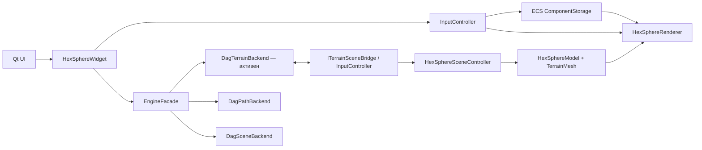

# GameNew — база знаний проекта

> [!summary] Что это
> Архитектурная документация по состоянию исходников на 2026-08-09. Описывает не только намерение, но и фактический runtime: активный DAG terrain backend, legacy-ветку, DAG пути и производных данных сцены, генерацию планеты, OpenGL-рендер, ECS, picking, путь и анимации.

## Маршруты чтения

- Новому разработчику: [[01 - Быстрый старт и runtime-карта]] → [[Архитектура/Системная архитектура]] → [[Архитектура/Карта модулей]].
- По бэкендам: [[Архитектура/Legacy и DAG бэкенды]] → [[Архитектура/Контракты и потоки данных]].
- По планете: [[Планета/Топология и процедурная генерация]] → [[Планета/Меш рельефа, вода и culling]].
- По руде и её миграции: [[Планета/Руда — старая и текущая реализация]].
- По взаимодействию: [[Взаимодействие/Ввод, picking и выделение клеток]] → [[Взаимодействие/Поиск пути и анимация движения]] → [[Взаимодействие/Постройки и сущности]].
- По графике: [[Рендеринг/Конвейер рендеринга]] → [[Рендеринг/Машинка, деревья и модели]] → [[Рендеринг/Каталог анимаций]].
- Для поддержки: [[Эксплуатация/Сборка, запуск, тесты и benchmark]] → [[Эксплуатация/Известные ограничения и техдолг]] → [[Эксплуатация/Индекс исходников]].

## Ключевой факт об архитектуре

`TerrainBackendSelector.h` задаёт `SelectedTerrainBackend = DagTerrainBackend`. Legacy terrain не удалён: он реализует тот же контракт и используется в сравнительном benchmark, но не выбран для обычного запуска.

## Обозначения

> [!info] Фактическое и потенциальное
> В заметках пометка **runtime** означает код, реально вызываемый в обычном Planet mode. **Альтернативный/неподключённый** означает скомпилированный или сохранённый код, который сейчас не входит в основной поток.

Исходники расположены в `F:\GameNew\Planet`. Ссылки вида [InputController.cpp](../../controllers/InputController.cpp) открывают оригинальный файл вне vault.
