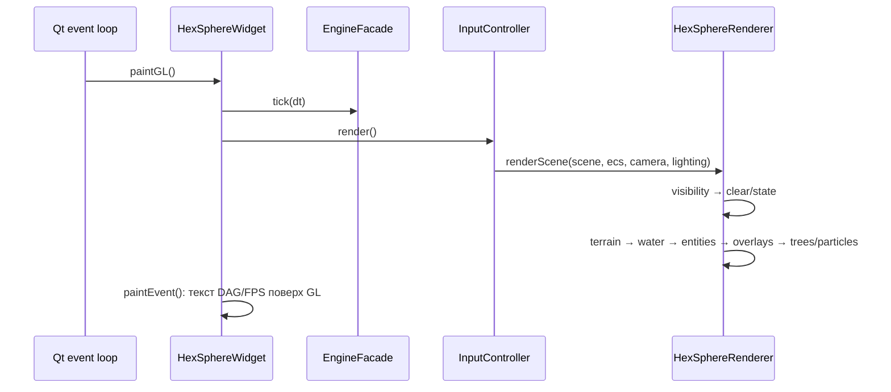

# Быстрый старт и runtime-карта

## Технологический стек

- C++20, Visual Studio/MSBuild, Qt Widgets и `QOpenGLWidget`.
- OpenGL 3.3 Core, depth 24, stencil 8, MSAA ×4.
- GLM присутствует как vendored dependency, основной math-код использует Qt (`QVector3D`, `QMatrix4x4`, `QQuaternion`).
- Встроенная библиотека ProcessDAG из `third_party/ProcessDAG`.
- OBJ/MTL и текстуры для машины, фабрики, шахты; деревья могут строиться процедурно.

## Запуск приложения

1. [main.cpp](../../core/main.cpp) создаёт формат OpenGL.
2. Без `--benchmark` создаётся `QApplication`, затем `MainWindow` размером 1280×800.
3. `defaultAppViewConfig()` выбирает Planet mode, пока `kContributorMode == false`.
4. `MainWindow` создаёт `CameraController`, `InputController`, `HexSphereWidget`, toolbar, меню команд и `PlanetSettingsPanel`.
5. `HexSphereWidget::initializeGL()` инициализирует renderer и стартует 16-мс таймер ECS-анимаций.

## Один кадр

Отдельный `animationTimer_` примерно каждые 16 мс вызывает `InputController::updateAnimations(dt)`, то есть `ecs::ComponentStorage::update(dt)`, и затем `update()` для нового кадра.

## Главные пользовательские действия

| Действие | Реакция |
|---|---|
| ЛКМ по клетке | CPU ray/triangle picking, toggle выделения; если выбрана машина — построение пути и движение |
| ЛКМ по сущности | sphere-collider picking и выбор сущности |
| ПКМ + drag | вращение камеры/планеты через quaternion |
| Колесо | дистанция камеры 1.2–10.0 |
| `P` | путь между ровно двумя выбранными клетками |
| `W` | шаг выбранной машины к доступному соседу |
| `+/-` | изменение дискретной высоты выбранных клеток |
| `1…8` | смена биома выбранных клеток |
| `S` | smooth one-step; влияет на геометрию и допустимый перепад пути |
| `O` | переключает флаг визуализации руды, но текущий renderer его не использует |
| Factory/Mine/Delete | режим размещения здания на свободном соседе машины или удаления здания |

## Два режима сцены

- **Planet** — весь основной функционал, EngineFacade и DAG.
- **Contributor** — sandbox одного дерева: настройки планеты и команды отключены, EngineFacade не создаётся, остаётся камера и contributor asset/particles. Переключается compile-time константой в [AppViewConfig.h](../../core/AppViewConfig.h).

См. [[Системная архитектура]] и [[Каталог анимаций]].
