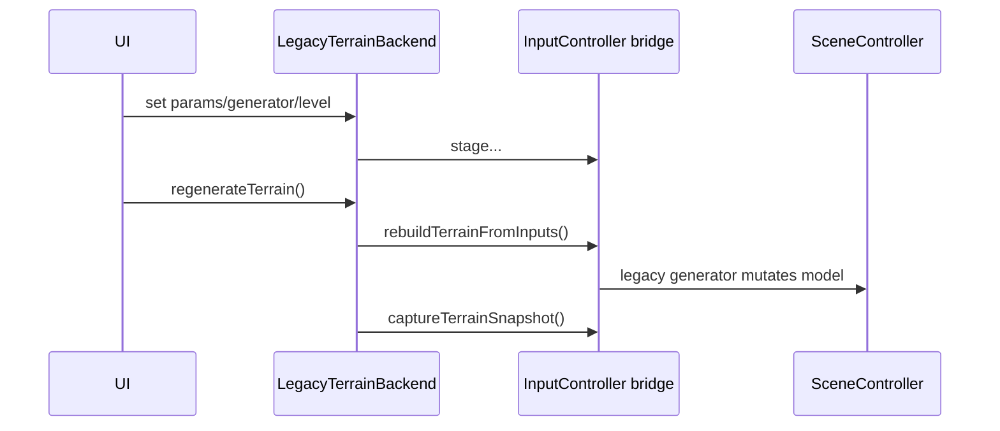

# Legacy и DAG бэкенды

## Выбор backend

В [TerrainBackendSelector.h](../../../dag/TerrainBackendSelector.h):

```cpp
using SelectedTerrainBackend = DagTerrainBackend;
```

Это compile-time выбор. Чтобы вернуть legacy terrain, alias меняется на `LegacyTerrainBackend`; оба проверяются concept `TerrainBackend`.

## Общий контракт terrain

`ITerrainSceneBridge` отделяет backend от живой сцены:

- stage params / generator / subdivision;
- rebuild terrain from staged inputs;
- capture snapshot;
- project snapshot.

`InputController` реализует bridge, делегируя в `HexSphereSceneController`.

## LegacyTerrainBackend

Legacy не строит модель сам. Setter сразу stage-ит значение в bridge и синхронизирует собственный snapshot из сцены. `regenerateTerrain()` вызывает `bridge->rebuildTerrainFromInputs()`:



Плюсы: минимум serialization и дублирования topology. Минус: backend тесно зависит от живой сцены и всегда пересчитывает производные данные монолитно.

## DagTerrainBackend

Схема содержит inputs `generatorIndex`, `seed`, `seaLevel`, `scale`, `subdivisionLevel` и два последовательных node: `TerrainBuild/buildTerrain` создаёт `baseTerrainSnapshot`, затем `OreBuild/generateOre` добавляет отдельное поле залежей и выдаёт итоговый `terrainSnapshot`.

Executor:

1. строит `IcosphereBuilder::build(level)`;
2. создаёт новый `HexSphereModel`;
3. запускает выбранный terrain generator;
4. превращает клетки в base snapshot;
5. второй node восстанавливает topology и запускает `OreGenerator`;
6. сериализует финальный snapshot в compact JSON commit.

Backend создаёт `DefaultDagEngine` на regeneration, `init` inputs → `flush_prepare` → читает output → deserialization → `ack_outputs` → project через bridge. Setter-ы только меняют staged state backend, не живую сцену.

> [!important] Runtime
> В обычном Planet mode именно этот путь активен. После projection `HexSphereSceneController` заново строит topology, копирует cell fields, перестраивает terrain mesh и деревья.

## DagPathBackend

Это отдельный долгоживущий DAG engine с inputs snapshot, `smoothMaxDelta`, start и goal; node `FindPath` реконструирует модель и вызывает обычный `PathBuilder`. DAG здесь orchestration/cache boundary, сам алгоритм A* остаётся legacy C++ классом.

## DagSceneBackend

Три guarded node:

| Node | Зависимости | Output |
|---|---|---|
| `BuildSelectionOutline` | terrain + selected + visual | float array линий |
| `BuildTreePlacements` | terrain | placements деревьев |
| `BuildModelPlacements` | terrain + visual + ECS requests | позиция/up сущностей |

Dirty определяется сравнением строковых ключей с предыдущим запросом. Внутри каждого executor есть `unordered_map` cache по полному ключу. Дополнительно ProcessDAG ведёт plan cache. Статистика попадает в нижний overlay.

> [!warning] Неполная интеграция
> `InputController::refreshSceneDagOutputs()` применяет selection outline и tree placements, но игнорирует `result.modelPlacements`. Позиции ECS всё ещё рассчитываются напрямую через `computeSurfacePoint`.

## Что означает «legacy backend» в проекте

Термин используется в двух смыслах:

1. конкретный `LegacyTerrainBackend` как альтернативная реализация terrain contract;
2. прямые CPU-функции `HexSphereSceneController`, `PathBuilder`, `SelectionOutlineGenerator`, которые DAG executor переиспользует или дублирует.

Отдельного `LegacyPathBackend` нет. Benchmark сравнивает DAG terrain с `LegacyTerrainBackend`, а DAG scene — с прямыми вызовами scene controller.
