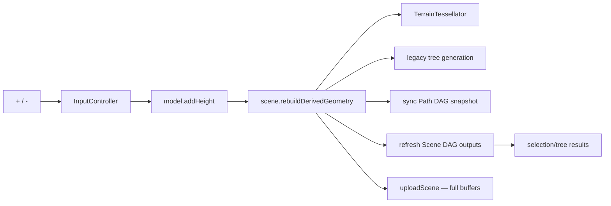

# Контракты и потоки данных

## TerrainSnapshot

Boundary-модель DAG содержит:

- `subdivisionLevel`, `generatorIndex`, `TerrainParams{seed, seaLevel, scale}`;
- для каждой клетки: height, biome, temperature, humidity, pressure, ore density/type, `OreVisualParams`, noise offset.

Topology (`centroid`, `neighbors`, `poly`, dual vertices) не сериализуется. Каждый DAG consumer реконструирует её детерминированно из `subdivisionLevel` и затем накладывает cell snapshot.

## JSON boundary

`TerrainSerialization.cpp` кодирует compact JSON version 1. В ProcessDAG значения хранятся как строки; int/float executor читает через `Commit::debug_view`. Это просто и наблюдаемо, но создаёт полную сериализацию всех клеток на regeneration, path query и scene-derived request.

## Scene и ECS — две модели состояния

`HexSphereSceneController`:

- topology и клетки;
- CPU terrain mesh;
- выбранные клетки;
- tree placements;
- визуальные параметры и camera visibility cache.

`ecs::ComponentStorage`:

- `Entity{id, name, currentCell, selected}`;
- sparse maps `Transform`, `Mesh`, `Collider`, `Material`, `Script`, `Animation`;
- update scripts и movement animation.

Они связываются через cell id. После terrain regeneration `refreshEntityTransformsForTerrain()` пересчитывает позиции сущностей, если `currentCell` остаётся валиден.

## Важные invariants

- Cell id совпадает с индексом primal vertex и индексом в `model.cells()`/snapshot cells.
- Соседи формируются CCW и используются как graph edges.
- `currentCell == -1` у движущейся сущности: позиция берётся из `Transform`, а не из клетки.
- Для выделения/terrain picking `triOwner` связывает каждый triangle terrain mesh с cell id.
- После смены subdivision старые cell ids семантически не сохраняют местоположение; код лишь проверяет диапазон и перепозиционирует сущность с тем же числом.

## Поток изменения одной высоты

Изменение вручную не обновляет `DagTerrainBackend::currentSnapshot`; path backend получает свежий snapshot напрямую из scene. Следующая полная DAG-регенерация заменит ручные изменения результатом generator.

## Два класса Entity

В проекте есть активный `ecs::Entity` и альтернативный `scene::Entity`. Не смешивать include-ы. Runtime renderer и input работают с `ECS/`; `scene/SceneGraph` сейчас самостоятельная неиспользуемая ветка.
