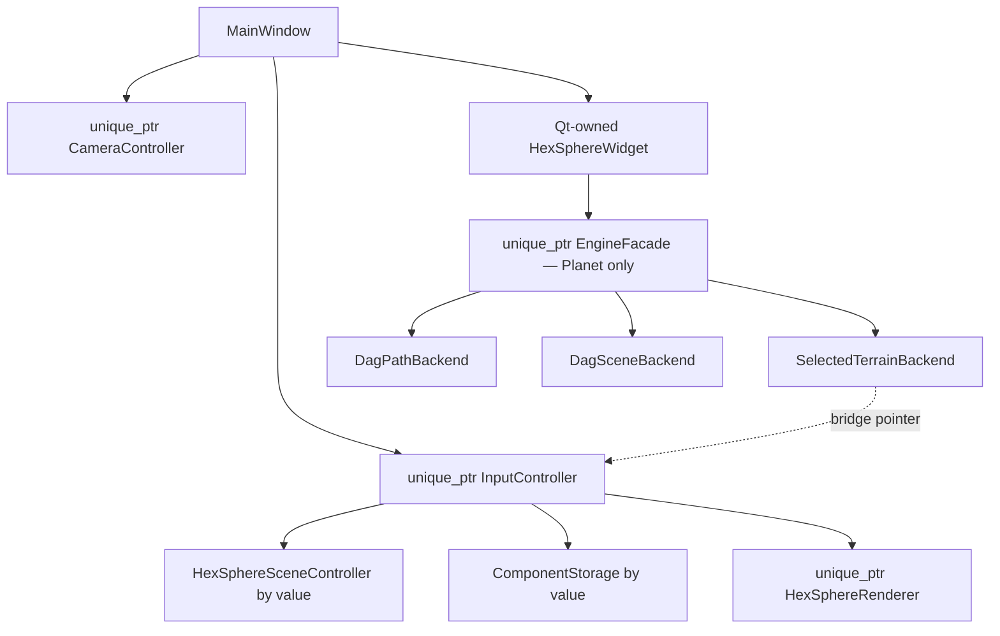

# Системная архитектура

## Слои

| Слой | Ответственность | Главные классы |
|---|---|---|
| UI | окно, панели, сигналы Qt, overlay | `MainWindow`, `PlanetSettingsPanel`, `HexSphereWidget` |
| Application/controller | команды, picking, orchestration, синхронизация ECS и сцены | `InputController`, `CameraController` |
| Facade/backend | единая точка terrain/path/scene DAG | `EngineFacade` |
| Domain/model | topology dual sphere, клетки, snapshot | `HexSphereModel`, `HexSphereSceneController` |
| Generation | terrain generators и CPU mesh builders | `TerrainGenerator`, `ClimateBiomeGenerator`, `TerrainTessellator` |
| ECS | сущности машины/зданий, компоненты, движение | `ecs::ComponentStorage` |
| Rendering | GPU resources и проходы | `HexSphereRenderer` и специализированные renderer-классы |

## Владение объектами

`HexSphereWidget` не владеет camera/input: хранит ссылки на объекты `MainWindow`. `EngineFacade` создаётся внутри widget и прикрепляется к `InputController` в двух направлениях: input вызывает facade, facade использует input как `ITerrainSceneBridge`.

## Источник истины

- Геометрическая topology и актуальные клетки runtime живут в `HexSphereSceneController::model_`.
- DAG terrain хранит свой `currentSnapshot`, но после regeneration проецирует его обратно в controller через bridge.
- ECS хранит runtime-сущности и их `currentCell`, `Transform`, `Mesh`, `Collider`, `Animation`.
- GPU-копии мешей принадлежат `HexSphereRenderer`.

Это гибридная архитектура: snapshot является boundary-форматом DAG, но непосредственный рендер берёт `scene` и `ecs`, а не DAG output store.

## Основные потоки

### Регенерация

`PlanetSettingsPanel` → Qt signal → `HexSphereWidget` → `InputController` → `EngineFacade` → `DagTerrainBackend` → ProcessDAG → JSON snapshot → bridge projection → `HexSphereSceneController` → CPU meshes/trees → upload GPU.

### Интеракция

Mouse/key → `InputController` → picking/command → mutation scene или ECS → scene DAG для outline/trees → selective/full buffer upload → repaint.

### Рендер

Controller собирает lightweight `RenderGraph{scene, ecs, heightStep}`. Renderer использует живые ссылки, camera matrices и lighting; terrain/water/overlays уже загружены в VBO/IBO, сущности и деревья собирают model matrices на кадре.

## Границы потоков и синхронность

Несмотря на поле `asyncBusy` в overlay и наличие `QtConcurrent` include, основной regeneration, DAG flush, picking и GPU upload выполняются синхронно в UI/GL потоке. Culling обновляет только IBO и тоже работает синхронно.
