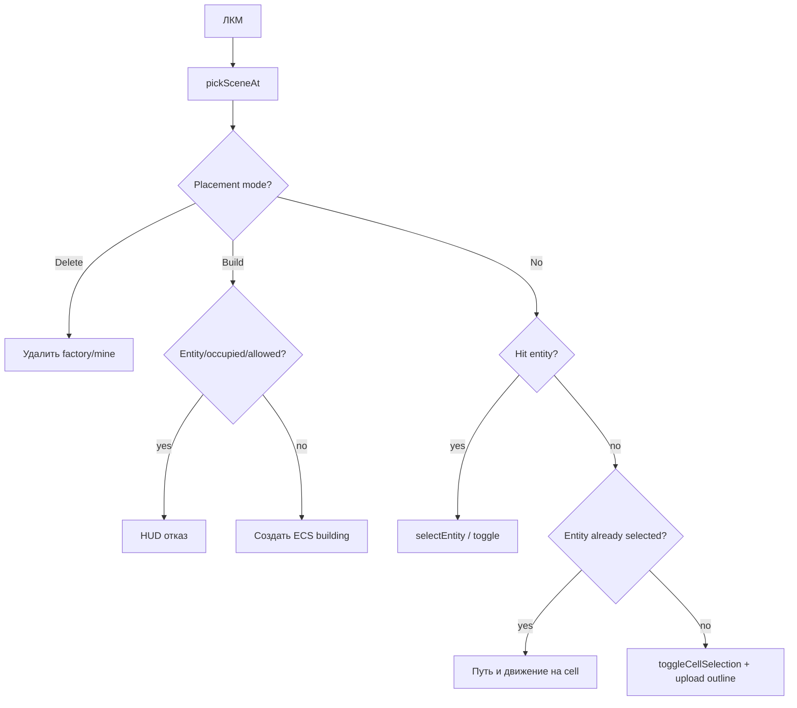

# Ввод, picking и выделение клеток

## Маршрутизация событий

Qt event handlers `HexSphereWidget` ничего не вычисляют: передают событие `InputController`, затем `applyResponse` обновляет HUD и планирует repaint.

## Camera

- ПКМ включает `rotating_`; mouse delta создаёт X/Y quaternions и умножает текущую rotation.
- View сначала `lookAt(eye=(0,0,distance), center=0)`, затем применяет sphere rotation.
- Wheel масштабирует distance на `0.9^steps` и clamp 1.2…10.
- Screen ray строится через inverse `(projection × view)` по near/far NDC.

## Picking terrain

Активный `pickTerrainAt` проходит по triangles текущего tessellated terrain, использует Möller–Trumbore, выбирает минимальный positive `t`, а cell id берёт из `triOwner`. Это height-aware picking: клики соответствуют реальному lifted/cliff mesh.

`pickCellAt` по старым normalized `model.pickTris()` существует отдельно, но основной `pickSceneAt` его не использует.

Сложность активного terrain picking линейна по числу triangles. На L6 только базовый terrain содержит не менее 1,2288 млн triangles, к которым добавляются slopes/cliffs. Пространственной acceleration structure и предварительного narrowing сейчас нет.

## Picking entities

Для каждой пары `Collider + Transform` выполняется ray/sphere intersection. `pickSceneAt` сравнивает ближайший entity hit и terrain hit. Collider — приближённая сфера, не triangle mesh модели.

## Логика ЛКМ

## Выделение клетки

`selectedCells_` — `QSet<int>`. Toggle меняет set и dirty flag. `uploadSelection()`:

1. сортирует selected IDs и извлекает из живого `HexSphereModel` только рёбра выбранных клеток;
2. формирует компактный `SelectionOutlineInput` с edge vectors, высотами и visual params;
3. вызывает отдельный `EngineFacade::rebuildSelectionOutline()`;
4. ProcessDAG планирует только `BuildSelectionOutline` и возвращает persistent output;
5. сохраняет outline cache в scene;
6. загружает GL_LINES VBO.

Пустой selection является успешным запросом и очищает VBO. При ошибке DAG используется прямой `SelectionOutlineGenerator`, поэтому stale outline не остаётся. Недействительные cell IDs безопасно отбрасываются при извлечении рёбер.

Если active building mode, визуализируется не selection set, а `buildPreviewCells_`. Preview строится прямым локальным generator, не вызывает selection DAG и не меняет cache обычного outline.

Стоимость outline теперь O(число рёбер выбранных клеток) и не зависит от subdivision level. Клик не вызывает `refreshSceneDagOutputs()`, `captureTerrainSnapshot()`, terrain JSON, topology reconstruction и tree/model decoding.

## Команды над клетками

`+/-` и biomes 1…8 мутируют все выбранные клетки, затем выполняют полный rebuild derived geometry и upload. `P` требует ровно две клетки. `Clear Selection` очищает клетки, но команда `C` очищает только path VBO.
