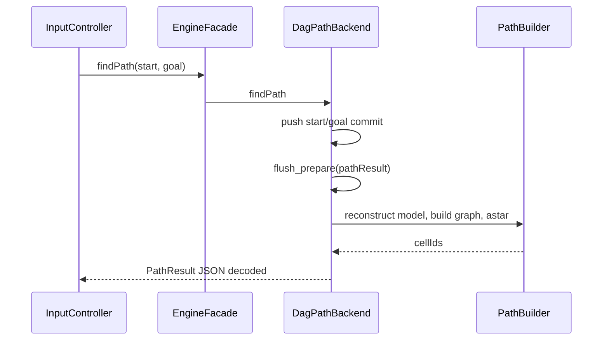

# Поиск пути и анимация движения

## Граф и доступность

Каждая cell — вершина, ordered `neighbors` — directed edges. Переход запрещён, если destination biome Sea или абсолютный перепад height выше climb limit.

`smoothOneStep=true` → limit 1; false → limit 0. Константа `kMaxClimbDelta=2` ограничивает общий API, но UI передаёт только 0/1.

Стоимость edge:

`angularDistance × average(biomeFactor(from), biomeFactor(to)) × slopePenalty`

Sea 2.4 (хотя blocked), Grass 1.0, Rock 1.45, Snow 1.8, Tundra 1.3, Desert 1.2, Savanna 1.1, Jungle 1.55. Подъём дороже спуска; heuristic A* — чистое angular distance.

## DAG path flow

Snapshot path backend синхронизируется после terrain regeneration и после ручного derived rebuild. Каждый query реконструирует topology/model внутри executor.

## Линия пути

`polylineOnSphere` делает 8 segments на edge через spherical interpolation (slerp), линейно интерполирует height и добавляет `pathBias=0.01`. Renderer загружает points в отдельный VBO и рисует `GL_LINE_STRIP`.

## Запуск движения Explorer

ЛКМ по target при выбранной машине:

1. проверяет диапазон, занятость и отсутствие активной Animation;
2. временно выделяет start и target;
3. получает DAG path и показывает линию;
4. создаёт dense polyline для движения;
5. ставит `entity.currentCell=-1`;
6. добавляет `ecs::Animation::MoveTo`.

Команда `W` ищет первый доступный сосед текущей клетки и запускает тот же pipeline. `P` лишь отображает путь, без движения.

## Временная параметризация

Длина animation path не просто геометрическая: каждый micro-segment умножается на отношение traversal cost/angular distance, поэтому сложные biomes и slopes замедляют машину. `duration = weightedLength / 0.35`, минимум 0.1 с.

`ComponentStorage::update` sample-ит polyline по cumulative weighted distance. Position следует path; optional radial bounce добавляется поверх. В текущих UI-вызовах bounce передаётся `0.0`, поэтому машина движется без прыжка, хотя biome-dependent параметры подготовлены.

## Ориентация и колёса

- Desired forward берётся из tangent последующего segment.
- Current forward поворачивается к desired вокруг radial normal с limit 540°/с.
- Направление копируется в `Transform::surfaceForward`, чтобы сохраниться после Animation.
- Renderer строит basis `{right, up=radial, forward}` и применяет `CarModelHandler::localAlignment()`.
- Wheel spin интегрируется из фактического world displacement / world wheel radius; каждый wheel submesh вращается вокруг собственного центра и оси.

## Завершение

Callback возвращает `currentCell=target`, фиксирует target position. Animation держится ещё один update для финальной ориентации и удаляется. Build preview в движении пуст, потому что Explorer имеет `currentCell=-1`; после завершения соседи снова подсвечиваются.
