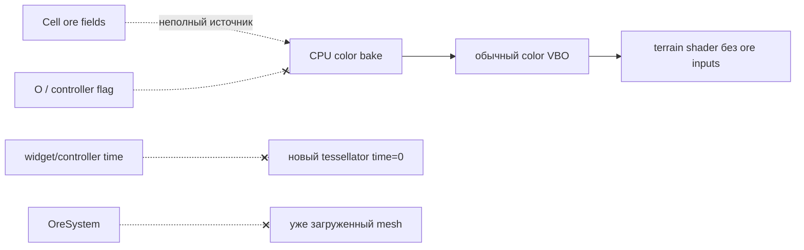
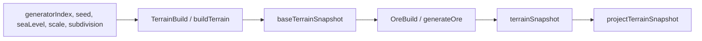
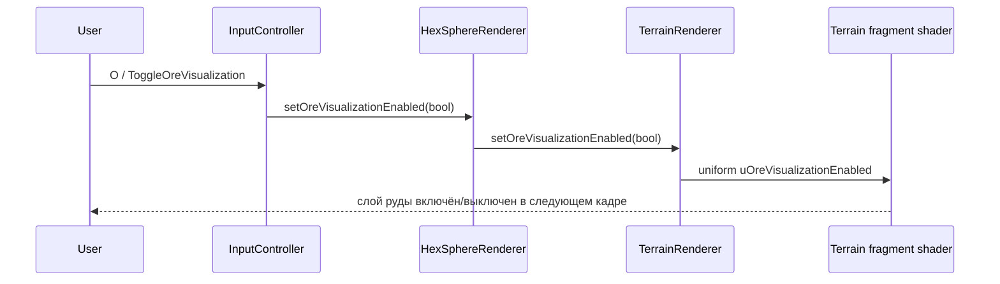

# Руда — старая и текущая реализация

> [!summary] Главное изменение
> Раньше данные о руде и её визуализация были набором слабо связанных CPU-механизмов: climate generator записывал поля клетки, tessellator пытался сразу запечь рудный цвет в `TerrainMesh::col`, а UI-флаг и время анимации не доходили до этого меша. Сейчас руда является отдельным этапом генерации и отдельным GPU-атрибутом terrain: `OreGenerator → TerrainSnapshot → TerrainMesh::ore → VBO location 3 → fragment shader`.

## Как было раньше

### Генерация данных

Рудные поля находились непосредственно в `Cell`:

- `oreDensity` — плотность 0…1;
- `oreType` — числовой тип;
- `oreVisual` и `oreNoiseOffset` — удалённые впоследствии параметры предполагавшейся визуализации.

Основным источником значений был `ClimateBiomeGenerator`. Он создавал Perlin field с `seed + 4000`, вычислял density, выбирал железо/медь, а затем ещё для 25% клеток принудительно назначал случайный тип 1…4 через глобальный `std::rand`. Другие terrain generators не имели общего самостоятельного этапа геологии: NoOp очищал руду, а Sine/Perlin в явном виде её не генерировали.

В старом DAG terrain был один node `TerrainBuild`, который одновременно строил terrain model и сериализовал получившиеся ore fields в snapshot. Руда не была отдельной зависимостью графа.

### Отображение на CPU

`TerrainTessellator::calculateCellColorWithOre()` пытался процедурно смешать biome color и mineral color ещё при построении CPU mesh. Функция получала `cell.centroid`, поэтому фактически вычисляла один оттенок для клетки/её triangles, а не мелкие жилы внутри поверхности. Результат записывался в общий `TerrainMesh::col`.

То есть после upload GPU видел только готовый RGB. У него не было ни `oreDensity`, ни `oreType`, ни возможности отдельно включить/выключить слой руды.

### Предполагавшаяся анимация

Существовали сразу несколько несоединённых частей:

- `OreSystem` мог хранить deposits и менять density;
- `HexSphereWidget` имел `oreAnimationTime_`, `initOreSystem()` и `updateOreAnimation()`;
- `InputController` хранил время, скорость и флаг отображения;
- `TerrainTessellator` имел собственные `animationTime_`, `enableOreVisualization` и noise generator;
- `HexSphereRenderer` имел одноимённые setter-ы/поля.

Единого владельца состояния и рабочего пути от таймера до пикселя не было.

## Почему раньше ничего не отображалось



Причина была не в одном условии, а в разорванном end-to-end pipeline:

1. **Не было общего генератора залежей.** Для Sine/Perlin гарантированного ore field не существовало. Результат зависел от выбранного terrain generator.
2. **Руда запекалась в RGB.** После создания меша shader не знал, где руда и какого она типа.
3. **Клавиша `O` не управляла пикселями.** Она меняла `InputController::oreVisualizationEnabled_`, но старый terrain shader не имел соответствующего uniform, а mesh не перестраивался.
4. **Время не доходило до tessellator.** Каждый `TerrainMeshGenerator` создавал новый tessellator с time 0. Значение из controller не передавалось в него.
5. **Таймер старого обновления не работал.** `updateOreAnimation()` не входил в активный animation loop; связанный timer не запускался.
6. **OreSystem не замыкал цикл.** Он инициализировался только после ручной regeneration, `update()` регулярно не вызывался, а `updateVisualParams()` был пустым. Даже изменение model после upload не обновило бы vertex colors без rebuild/upload.
7. **В renderer не было отдельного ore buffer.** Поэтому данные snapshot сами по себе не могли повлиять на fragment shader.

При удачном Climate snapshot старый CPU-код теоретически мог запечь слабый статический оттенок на отдельных triangles. Но toggle, анимация и стабильное появление залежей для всех рабочих generators были фактически не реализованы, поэтому на практике terrain выглядел как обычный.

## Как работает сейчас

### 1. Отдельный OreGenerator

[OreGenerator.cpp](../../../generation/OreGenerator.cpp) отделяет геологию от terrain/climate generation.

Для каждого `Biome::Rock`:

1. берётся нормализованный `cell.centroid`;
2. 4-octave FBM `depositNoise(seed + 4000)` с scale 3.5 создаёт поле `geology`;
3. density вычисляется как `smoothstep(0.58, 0.80, geology)`;
4. при density > 0 отдельный FBM `typeNoise(seed + 5000)` выбирает тип;
5. не-Rock клетки всегда получают `density=0`, `type=None`.

Пороговое fBm-поле создаёт пространственно коррелированные группы рудных клеток, но не гарантирует, что каждая залежь является одной связной компонентой.

Распределение type field после нормализации selector:

| Диапазон selector | Тип | GPU id |
|---|---|---:|
| `< 0.55` | Iron | 1 |
| `< 0.80` | Copper | 2 |
| `< 0.95` | Gold | 3 |
| остальное | Diamond | 4 |

Генерация детерминирована seed-ом и не использует глобальный `std::rand`.
Границы selector — это пороги поля шума, а не проценты ожидаемого количества типов: распределение fBm не является равномерным.

> [!note] NoOp
> При generator index 0 вызывается `OreGenerator::clear()`. Для индексов 1–3 новый ore field строится после terrain, поэтому Sine, Perlin и Climate используют один алгоритм геологии.

### 2. Явный этап DAG

Активный [DagTerrainBackend.cpp](../../../dag/DagTerrainBackend.cpp) теперь имеет два node:



`OreBuild` восстанавливает topology, копирует height/biome из base snapshot, запускает `OreGenerator` и записывает density/type в финальный snapshot. Таким образом ore generation имеет явную позицию после terrain/biome generation.

Legacy/direct path в `HexSphereSceneController::regenerateTerrain()` выполняет ту же последовательность: terrain generator, затем `OreGenerator`. Это сохраняет одинаковую модель данных для DAG и legacy backend.

После очистки `ClimateBiomeGenerator` больше не знает о density/type и отвечает только за terrain, климат и биомы. Единственный источник рудного поля — `OreGenerator`.

### 3. Отдельный атрибут TerrainMesh

`TerrainMesh` получил массив `ore`, по два float на vertex:

```text
[density, type, density, type, ...]
```

`MeshBuilder::triToward()` определяет ore data по `cellOwner` каждого triangle. Только `Biome::Rock` с корректным type и положительной density получает рудные значения; остальные клетки получают `(0, 0)`. Это защитная проверка поверх такого же инварианта `OreGenerator`. Caps, blades, corners и cliff triangles проходят через один builder, поэтому размер ore attribute синхронизирован с `pos/col/norm`.

Базовый `TerrainMesh::col` снова содержит только biome/temperature color. Благодаря этому переключение визуализации больше не требует CPU rebuild.

### 4. GPU binding

`HexSphereRenderer` создаёт `vboTerrainOre_`, загружает `mesh.ore` и подключает его к terrain VAO:

```cpp
layout(location = 3) in vec2 aOreData;
```

Vertex shader передаёт интерполируемую density и `flat` integer type во fragment shader. Type не интерполируется между вершинами triangle.

### 5. Fragment-shader жилы

Fragment shader использует нормализованную world position, поэтому рисунок непрерывно привязан к поверхности планеты, а не к UV модели. Из position строятся 4-octave value-noise/FBM, ridge, detail, vein mask и более широкий halo.

Density управляет порогами и интенсивностью. Полученный mineral color смешивается уже с освещённым biome color:

- Iron — тёмный ржаво-красный;
- Copper — ярко-оранжевый;
- Gold — жёлто-золотой;
- Diamond — голубой.

Текущий эффект **статический**: shader не имеет ore-time uniform. Старый CPU animation код и неработавший API скорости удалены; жилы не требуют пересборки меша каждый кадр.

### 6. Рабочее переключение



Состояние также передаётся renderer сразу после его initialization, поэтому initial value согласован. Перестраивать terrain mesh или повторно загружать VBO при `O` не требуется.

### 7. Диагностика через HUD

При выборе terrain cell HUD показывает `Cell id`, название `OreType` и округлённую density в процентах. Это позволяет отличить отсутствие залежи в данных от проблемы shader/rendering.

## Текущий источник истины по этапам

| Этап | Источник истины |
|---|---|
| Генерация залежи | `OreGenerator` |
| Передача между backend и scene | `TerrainCellSnapshot::oreDensity/oreType` |
| Runtime model | `Cell::oreDensity`, `Cell::oreType` |
| CPU→GPU | `TerrainMesh::ore` |
| Цвет/рисунок жил | `FS_TERRAIN` |
| Видимость слоя | `uOreVisualizationEnabled` |
| Проверка данных пользователем | cell selection HUD |

## Snapshot и проверки

`TerrainSerialization` записывает compact JSON snapshot версии 2. В нём остаются только актуальные поля terrain, климата и руды. Reader принимает версии 1 и 2: старые `oreVisual*`/`oreNoiseOffset` из v1 игнорируются, неизвестная версия или недопустимый `OreType` отклоняется.

Запускаемый через `--benchmark` self-check проверяет детерминизм OreGenerator, изменение поля при другом seed, запрет руды вне Rock, контракт `TerrainMesh::ore`, round-trip v2, чтение v1 и отказ на повреждённых данных. GPU binding и клавиша `O` дополнительно проверяются при визуальном smoke test.

## Файлы реализации

- [generation/OreGenerator.h](../../../generation/OreGenerator.h) и [OreGenerator.cpp](../../../generation/OreGenerator.cpp) — геология.
- [dag/DagTerrainBackend.cpp](../../../dag/DagTerrainBackend.cpp) — `TerrainBuild → OreBuild`.
- [controllers/HexSphereSceneController.cpp](../../../controllers/HexSphereSceneController.cpp) — direct/legacy последовательность и projection.
- [renderers/TerrainTessellator.h](../../../renderers/TerrainTessellator.h) и [TerrainTessellator.cpp](../../../renderers/TerrainTessellator.cpp) — ore attribute.
- [renderers/HexSphereRenderer.cpp](../../../renderers/HexSphereRenderer.cpp) — VBO/VAO binding.
- [renderers/TerrainRenderer.cpp](../../../renderers/TerrainRenderer.cpp) — toggle uniform.
- [resources/HexSphereWidget_shaders.h](../../../resources/HexSphereWidget_shaders.h) — процедурные жилы.
- [controllers/InputController.cpp](../../../controllers/InputController.cpp) — toggle и HUD.

См. также [[Топология и процедурная генерация]], [[Меш рельефа, вода и culling]], [[Legacy и DAG бэкенды]], [[Каталог анимаций]].
