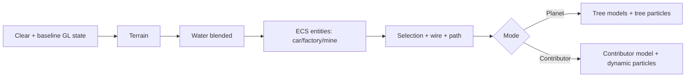

# Конвейер рендеринга

## Инициализация

`HexSphereRenderer::initialize`:

- включает depth test/culling;
- компилирует embedded shader strings;
- создаёт programs terrain/wire/selection/water/model/factory/steam;
- создаёт VAO/VBO/IBO;
- строит environment cubemap;
- загружает procedural/fallback trees и OBJ assets car/factory/mine;
- создаёт specialized renderers.

Модели загружаются при активном OpenGL context. `ModelHandler::loadShared` кэширует generic модели по canonical path.

## Upload phase

`uploadScene` владеет `makeCurrent/doneCurrent` и последовательно загружает:

1. wire;
2. terrain attributes и indices;
3. selection outline;
4. очищает path;
5. water geometry.

> [!warning] Path lifecycle
> Любой полный `uploadScene` очищает path VBO. Selection-only upload путь не трогает.

## Frame passes

Порядок в коде отличается от старого task brief: entities рисуются до overlays, trees — после overlays. Depth testing остаётся включённым, поэтому линии не являются безусловно screen-top.

## Terrain

Indexed triangles, per-vertex position/color/normal, identity model matrix, directional lighting. Culling может уменьшить `terrainIndexCount_` без изменения attributes.

## Water

Indexed mesh, animated shader time, light/view/cubemap. Alpha blending включено, depth write выключено, затем state восстанавливается.

## Entities

EntityRenderer ветвится по `meshId`: factory, mine, иначе car. Каждая модель самостоятельно рисует submeshes, textures и MTL colors. Culling faces выключается для сложных OBJ.

## Overlays

Три VAO: selection `GL_LINES`, global wire `GL_LINES`, path `GL_LINE_STRIP`. Selection использует отдельный fragment shader.

## Trees и particles

До 96 tree models. Затем particle representation foliage до 30 000 points. Placement hash предотвращает перестройку particle buffer, пока trees не менялись.

## Qt overlay

После GL frame `paintEvent` рисует QPainter-текст с scene version, DAG flag, dt/fps, executed/skipped/cache. HUD label и placement panel являются Qt children поверх `QOpenGLWidget`.
