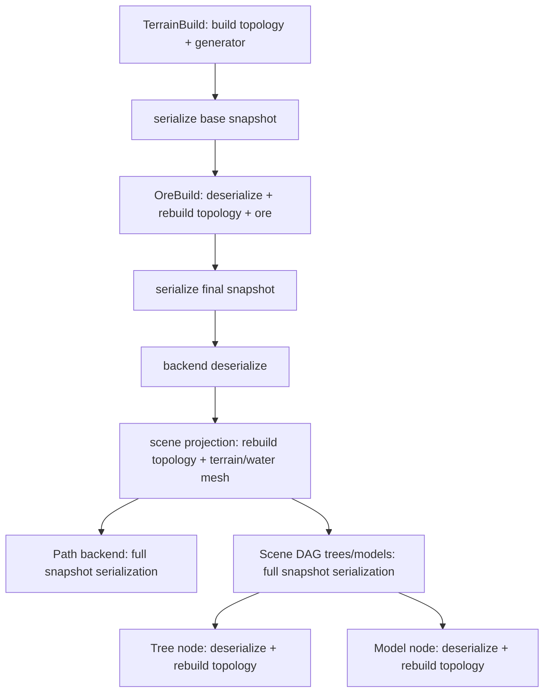
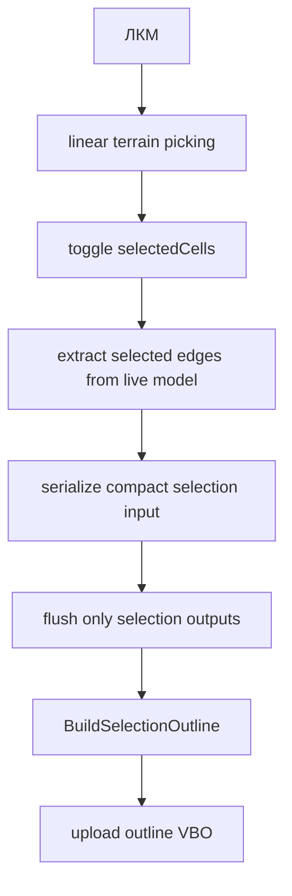
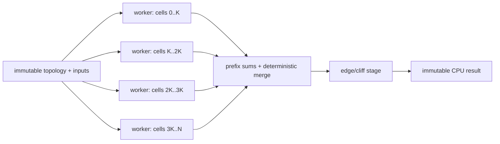

# Аудит производительности высоких subdivision

> [!summary] Главный вывод
> Найденный 165-секундный bottleneck shore-distance устранён точным сферическим BVH, кэшем повторных позиций и параллельными запросами. В реальном Debug runtime полная генерация L4 сократилась с 168,81 до 3,71 с, а surface atlas — со 165,56 до 0,504 с. L5 теперь завершается за 15,01 с. Следующий приоритет — пункты 2–3: убрать двойной CPU culling и сравнить его с неизменяемым IBO + culling OpenGL.

Аудит выполнен по текущим исходникам 2026-08-15. Расчётные размеры topology дополнены фактическими Debug-замерами L2/L3/L4 через `[Perf][Generation]`. Абсолютные времена Debug нельзя использовать как Release budget, но они однозначно показывают алгоритмическое соотношение стадий.

## Масштаб данных

Для уровня `L`:

- primal faces: `20 × 4^L`;
- primal edges: `30 × 4^L`;
- cells: `10 × 4^L + 2`;
- сумма степеней dual cells: `60 × 4^L`.

Текущий terrain tessellator создаёт минимум пять triangles на каждую сторону cell: один cap, два blade и два corner triangle. Cliffs и slopes добавляются сверху. Water proxy создаёт fan по всем клеткам, а затем каждый triangle делится ещё на `4^2 = 16` triangles.

| Level | Cells | Минимум terrain triangles | Water triangles |
|---:|---:|---:|---:|
| 2 | 162 | 4 800 | 15 360 |
| 3 | 642 | 19 200 | 61 440 |
| 4 | 2 562 | 76 800 | 245 760 |
| 5 | 10 242 | 307 200 | 983 040 |
| 6 | 40 962 | 1 228 800 | 3 932 160 |

Каждый следующий level увеличивает почти все линейные проходы и объёмы примерно в четыре раза. Поэтому алгоритм, незаметный на L2, на L6 получает уже `256×` исходной работы.

## Измеренный baseline до P0

| Level | Полное переключение level | До renderer, включая terrain DAG/projection | Surface atlas total | Shore-distance tests | Доля atlas |
|---:|---:|---:|---:|---:|---:|
| 2 | ≈1,36 с для `uploadBuffers` | — | 1,3006 с | 2 102 400 | ≈96% upload |
| 3 | 17,446 с | 0,587 с terrain backend | 16,612 с | 27 993 600 | 95,2% |
| 4 | 168,808 с | 2,261 с terrain backend | 165,562 с | 279 244 800 | 98,1% |

На L4 atlas обрабатывает 76 800 kept triangles, то есть 230 400 неиндексированных atlas vertices, и 1 212 shoreline arcs. Текущий вложенный цикл выполняет точно `230 400 × 1 212 = 279 244 800` дорогих сферических distance tests. Переход L3→L4 увеличивает число tests в 9,97 раза и `distance_field_ms` также в 9,97 раза. Это подтверждает причинную связь, а не только корреляцию по общему времени кадра.

Построение shoreline arcs на L4 занимает лишь 2,5 мс, upload atlas buffers — 1,1 мс, atlas render submission — меньше 1 мс. Следовательно, bottleneck находится в CPU-поиске ближайшей дуги, а не в OpenGL, DAG, JSON, GPU upload или построении списка берегов. Release уменьшит константу, но не исправит сложность `O(atlas vertices × shoreline arcs)`.

### После P0: CPU shore-distance

Фиксированный default climate seed, те же L2/L3/L4 topology и terrain mesh:

| Level | Atlas vertices | Unique positions | Arcs | Точные BVH tests | Старый полный `vertices × arcs` | Debug query | Release query |
|---:|---:|---:|---:|---:|---:|---:|---:|
| 2 | 14 400 | 3 427 | 146 | 49 513 | 2 102 400 | 37,6 мс | 5,7 мс |
| 3 | 57 600 | 13 155 | 486 | 346 914 | 27 993 600 | 65,1 мс | 10,4 мс |
| 4 | 230 400 | 50 107 | 1 212 | 1 032 542 | 279 244 800 | 250,2 мс | 37,7 мс |

На L4 точных вызовов стало примерно в 270 раз меньше старого runtime-пути. Debug CPU query ускорился примерно в 662 раза относительно исходных 165,56 с. Это изолированный замер CPU builder; ниже приведён уже полный GUI runtime-профиль.

### После P0: полный Debug runtime L2–L5

Ручной последовательный прогон дошёл до L5 и подтвердил, что ускорение сохраняется внутри настоящего renderer/upload pipeline, а не только в unit benchmark.

| Level | Полная генерация до | Полная генерация после | Ускорение полной генерации | Atlas total до | Atlas total после | Ускорение atlas |
|---:|---:|---:|---:|---:|---:|---:|
| 2 | нет сопоставимого полного замера | — | — | 1,3006 с | 0,0580 с | 22,4× |
| 3 | 17,446 с | 0,953 с | 18,3× | 16,612 с | 0,1303 с | 127,5× |
| 4 | 168,808 с | 3,709 с | 45,5× | 165,562 с | 0,5039 с | 328,6× |
| 5 | не был практически достижим в старом прогоне | 15,011 с | — | нет завершённого baseline | 2,270 с | — |

Старый L2 baseline содержал только `uploadBuffers ≈ 1,36 с`, поэтому его нельзя честно сопоставлять с полным `set_subdivision_total`. Для L5 старый полный прогон не завершался; значение «до» не экстраполируется как измеренный результат.

Новая генерация масштабируется почти линейно относительно числа элементов: L3→L4 даёт 3,89× по времени, L4→L5 — 4,05×, тогда как topology и число terrain triangles на каждом level растут примерно в 4 раза. До P0 рост был намного хуже: количество atlas vertices росло в 4 раза, одновременно росло число shoreline arcs, и эти величины перемножались.

| Level | Atlas vertices | Unique directions | Cache hits | Shoreline arcs | Точные BVH tests | Старый полный `vertices × arcs` | Query | Atlas total |
|---:|---:|---:|---:|---:|---:|---:|---:|---:|
| 2 | 14 400 | 3 427 | 10 973 | 146 | 49 513 | 2 102 400 | 40,1 мс | 58,0 мс |
| 3 | 57 600 | 13 176 | 44 424 | 486 | 347 489 | 27 993 600 | 65,0 мс | 130,3 мс |
| 4 | 230 400 | 50 250 | 180 150 | 1 212 | 1 035 789 | 279 244 800 | 248,3 мс | 503,9 мс |
| 5 | 921 600 | 197 388 | 724 212 | 2 918 | 5 612 837 | 2 689 228 800 | 1 253,5 мс | 2 270,2 мс |

На L5 BVH оставляет 5,61 млн точных проверок вместо потенциальных 2,689 млрд — в 479 раз меньше. Относительно уже дедуплицированного полного перебора `197 388 × 2 918 = 575 978 184` выполняется менее 1% exact tests. Из 921 600 выходных atlas vertices 724 212 используют уже рассчитанное расстояние той же bitwise-позиции.

#### Почему раньше было настолько долго

Для каждой вершины atlas старый код заново просматривал весь список береговых дуг. Одна проверка `angularDistanceToArc` — это не простое сравнение: она выполняет сферическую геометрию, нормализации, скалярные произведения и тригонометрические операции, чтобы определить расстояние до внутренней части дуги или её endpoint. На L4 эта дорогая операция вызывалась 279 244 800 раз.

Главная проблема заключалась в произведении двух растущих величин. При повышении subdivision число atlas vertices возрастает примерно в 4 раза; более подробная береговая линия одновременно увеличивает число arcs. Поэтому стоимость росла как `O(V × A)`, а не как обычный линейный проход по мешу. L3→L4 увеличил число проверок с 27,99 до 279,24 млн — почти в 10 раз — и время distance field выросло в той же пропорции.

Дополнительно atlas geometry неиндексированная: одна геометрическая точка встречается в нескольких соседних triangles. Старый путь не распознавал эти повторы и вычислял одно и то же расстояние снова. На L5 только 197 388 из 921 600 позиций уникальны, то есть без кэша около 78,6% запросов являлись повторной работой.

#### За счёт чего время сократилось

1. **Дедупликация позиций.** Точный bitwise-ключ `QVector3D` объединяет повторяющиеся направления. Расстояние вычисляется один раз для unique direction, после чего результат разворачивается обратно в прежний порядок vertices; знак Sea/Land применяется отдельно. Это уменьшило L5 с 921 600 потенциальных запросов до 197 388 без изменения геометрии или результата.

2. **Точный сферический BVH.** Shoreline arcs организованы в дерево bounding caps. Query сначала идёт в ближайшую ветвь и отбрасывает целый узел, если доказанная нижняя граница уже хуже найденного расстояния. Вместо проверки всех 2 918 arcs L5-запрос обычно доходит только до небольшой группы кандидатов. В leaf по-прежнему вызывается исходная точная `angularDistanceToArc`, поэтому ускорение не является приближением.

3. **Параллельные независимые запросы.** При 4096 и более unique positions работа распределяется через `QtConcurrent` и глобальный `QThreadPool`. В runtime-прогоне использовались 4 worker-потока. Индекс после построения неизменяем, каждый worker записывает только собственный результат, а OpenGL upload остаётся в render thread.

4. **Разделение CPU и OpenGL.** `SurfaceAtlasMeshBuilder` формирует positions, kinds и signed distances как чистый CPU-модуль. `PlanetSurfaceAtlasPass` только загружает готовые массивы и рендерит прежние cubemap textures. Это сделало алгоритм тестируемым и не добавило GL-синхронизаций в workers.

Шейдеры воды, разрешение и формат cubemap atlas, волны, пена, освещение и береговое затухание не менялись. Автотесты сравнивают ускоренный путь с сохранённым brute-force oracle с epsilon `1e-5`, поэтому выигрыш получен устранением лишней работы, а не снижением качества эффекта.

## Где умножается стоимость

### Regeneration terrain

При смене subdivision активный DAG путь выполняет следующую цепочку:

После оптимизации selection topology всё ещё строится до пяти раз: terrain, ore, scene projection и в двух Scene DAG nodes trees/models. Дополнительно snapshot многократно переводится между C++ структурами, `QJsonObject/QJsonArray`, `QString` и `std::string`.

### Обычный клик по клетке

После выполнения пункта 1 selection-часть клика зависит только от 5–6 рёбер одной клетки (или суммы рёбер multi-selection). Оставшаяся крупная задержка клика на L4+ относится к линейному terrain picking и рассматривается в пункте 4. Неограниченный `selectionCache` удалён; tree/model caches пока не имеют eviction.

### Движение камеры и кадр

`HexSphereRenderer::updateVisibility` сначала вызывает `hasCameraMoved`. Для debug-статистики `hasCameraMoved` вызывает `getVisibilityStats`, а он строит полный visible index list. После возвращения renderer строит тот же список второй раз и передаёт его в новый `glBufferData` terrain IBO. Это прямой повтор тяжёлой функции в одном update.

Даже без движения камеры каждый кадр рисуется полный water proxy. Terrain visibility не применяется к воде. Wire overlay также рисуется целиком, но его объём заметно меньше water и terrain geometry.

## План исправления

Ниже сохранены одиннадцать исходных направлений и добавленная замерами задача `P0`. Пункты 1 и P0 выполнены; текущий следующий шаг — пункты 2–3 про culling. Профилирование из пункта 11 остаётся сквозной работой.

### 1. Убрать полный Scene DAG pipeline из выделения клетки

> [!success] Выполнено
> `BuildSelectionOutline` сохранён как DAG-node, но переведён на отдельный лёгкий pipeline.

**Реализация.** `SelectionOutlineGenerator` сначала детерминированно извлекает `SelectionOutlineInput` из живой topology: selected IDs сортируются, invalid IDs отбрасываются, а каждое ребро содержит два unit vectors, высоту клетки и соседа. Второй этап строит vertices только из этого input.

`DagSceneBackend::rebuildSelectionOutline()` сериализует компактный запрос O(selected edges) и вызывает `flush_prepare` только для `selectionOutline`/`selectionSuccess`. Node зависит от `selectionInput + selectionDirty`; terrain snapshot, visual params общего scene request и selectedCells из схемы удалены. Неограниченный `selectionCache` заменён одним `lastSelectionKey` и persistent ProcessDAG output.

`InputController::uploadSelection()` больше не вызывает `refreshSceneDagOutputs()`. При success результат сохраняется в scene и загружается в небольшой VBO; при DAG error используется прямой generator. Empty selection успешно очищает VBO. Building preview остаётся прямым локальным путём и не затрагивает обычный selection cache.

**Проверки.** `--selection-tests` фиксирует pentagon/hexagon edge counts, stable ordering, invalid IDs, empty output, direct/DAG equivalence, heights/bias/smooth, serialization round-trip, сопоставимый L2/L4 request size, один executed node, guard skip на repeat и изоляцию tree/model outputs. Benchmark получил отдельную категорию `selection-derived` с L2/L4 сценариями и метрикой `input_bytes`.

### P0. Устранить полный перебор shoreline arcs для каждой atlas vertex

> [!success] Выполнено
> Внешний water pipeline, шейдеры и три cubemap atlas не изменены. Brute-force сохранён как тестовый oracle.

**Проблема.** `PlanetSurfaceAtlasPass::updateMesh()` строит shore-distance для каждой вершины каждого сохранённого terrain triangle. Для каждой такой вершины линейно перебираются все shoreline arcs с вызовом `angularDistanceToArc`. Terrain top geometry неиндексированная, поэтому одинаковые позиции дополнительно обрабатываются несколько раз. Фактическая сложность — `O(V × A)`, где `V` — atlas vertices, `A` — shoreline arcs.

**Реализация.** Чистый `SurfaceAtlasMeshBuilder` отделён от OpenGL. `ShoreDistanceIndex` строит бинарный BVH над spherical caps дуг, делит их по широкой координате midpoint и хранит до 8 arcs в leaf. Query посещает ближний child первым и отсекает node только по доказанной нижней угловой границе. Поэтому нет cubemap seams или приближённого радиуса поиска.

Bitwise-одинаковые `QVector3D` объединяются внутри одного build; знак Sea/Land применяется после восстановления исходного порядка vertices. Начиная с 4096 unique positions запросы выполняются через `QtConcurrent` в глобальном `QThreadPool`; GL upload остаётся в render thread.

**Проверки.** `--surface-atlas-tests` сравнивает BVH с brute-force oracle с epsilon `1e-5`: endpoints/midpoints, пустые и degenerate arcs, полюса, длинные дуги, детерминированные random cases, реальные L2/L3 topology, signed Sea/Land output, vertex ordering, duplicate cache и serial/parallel equality. L4 structural assertion требует менее 10% от `unique positions × arcs`; фактически получилось 1,70%, либо 0,37% от старого `atlas vertices × arcs`.

**Runtime-подтверждение.** Ручной GUI-прогон L2–L5 подтвердил полное время 0,953/3,709/15,011 с для L3/L4/L5 и нормальное масштабирование около 4× на level. Числовая эквивалентность и неизменность shader/atlas contracts покрыты автоматическими тестами. При пользовательском запуске визуальные регрессии не были сообщены, но отдельный формальный smoke checklist пены, волн, бликов, узких островов и береговых углов всё ещё полезен перед закрытием визуальной проверки.

### 2. Убрать двойной CPU culling и перестать пересоздавать IBO при движении камеры

**Проблема.** Один visibility update дважды вызывает `getVisibleIndices`: из `hasCameraMoved → getVisibilityStats` и непосредственно из renderer. Затем `glBufferData` заново выделяет/передаёт index buffer. Culling линейно нормализует center каждой triangle и создаёт временный vector индексов.

**Минимальный этап.** Удалить вычисление visibility из debug logging: статистика должна использовать уже полученный список. Следующим baseline-режимом полностью отключить triangle-level CPU filtering, один раз загрузить полный статический IBO и больше не менять его при camera rotation. Это устраняет CPU scan, временные index vectors, `glBufferData` и вероятную CPU/GPU synchronization.

**Fallback, если полный mesh слишком дорог GPU.** Временно оставить один traversal, заранее хранить normalized radial normal, переиспользовать capacity CPU vector и обновлять заранее выделенное GPU storage. Это промежуточный вариант, а не целевая архитектура.

**Критерий готовности.** В основном runtime отсутствуют triangle-level CPU scan и terrain IBO upload при вращении камеры. Camera rotation не создаёт frame spikes, пропорциональные всем terrain triangles.

**Риски и проверки.** Сравнить CPU frame time, GPU terrain pass и p95 frame time, а не только средний FPS. Проверить winding всех caps/slopes/cliffs: неправильная ориентация станет видна после передачи back-face rejection GPU.

### 3. Использовать culling OpenGL 3.3 и при необходимости крупные terrain chunks

**Что уже умеет OpenGL 3.3.** `GL_CULL_FACE` отбрасывает back-facing primitives, clip stage удаляет geometry вне frustum, depth test и early depth rejection сокращают fragment workload. В renderer уже включены `glEnable(GL_CULL_FACE)`, `glCullFace(GL_BACK)` и `GL_DEPTH_TEST`. Поэтому текущий CPU radial culling частично дублирует работу graphics pipeline.

**Ограничение.** Back-face culling происходит после vertex shader: vertices задней половины всё равно обрабатываются. OpenGL 3.3 не предоставляет современный compute/meshlet/multi-draw-indirect pipeline. Geometry shader технически доступен, но обычно невыгоден как массовый triangle culler, потому что vertex work уже выполнена, а geometry stage снижает throughput. Occlusion queries мало помогают одной крупной планете, которая почти всегда частично видима.

**Первый целевой режим.** Рисовать один полный shared indexed terrain mesh с неизменяемым IBO и полагаться на `GL_CULL_FACE`, clipping и depth test. Для сферы это простой и часто более дешёвый вариант, чем каждый camera update сканировать все triangles на CPU и передавать новый список indices.

**Гибридный режим.** Если L5/L6 упирается в vertex stage, разделить terrain по 20 базовым faces икосаэдра или их дочерним группам. CPU проверяет bounding sphere/cone десятков chunks, а OpenGL выполняет точный face/depth culling внутри видимых chunks. Index ranges остаются постоянными; меняется только небольшой список draw calls.

**Сравниваемые варианты.** Benchmark должен измерить три конфигурации на одинаковой camera path: текущий CPU triangle culling, полный mesh + OpenGL culling, chunk culling + OpenGL culling. Выбирается вариант с лучшим p95 frame time, отдельно фиксируются CPU и GPU milliseconds.

**Критерий готовности.** Culling не создаёт O(all triangles) CPU работу при camera rotation. Terrain IBO остаётся неизменным. Невидимая сторона не растеризуется, а при chunk mode CPU обрабатывает десятки bounds вместо сотен тысяч triangles.

**Риски и проверки.** Chunk bounds должны учитывать максимальную высоту и waves не относятся к terrain bounds. Проверить горизонт, cliffs, близкую camera, быстрое вращение, frustum edges и отсутствие исчезающих chunks.

### 4. Заменить линейный picking пространственным или GPU picking

**Проблема.** `pickTerrainAt` проверяет Möller–Trumbore для каждой triangle и внутри цикла создаёт три `QVector3D`. На L6 это минимум 1,2 млн tests на клик, не считая cliffs/slopes. Затем selection запускает дополнительную полную обработку.

**Варианты.**

1. **GPU ID buffer** — отдельный pass пишет `cellId` в integer texture; клик читает один pixel. Хорошо совпадает с фактической tessellated geometry и корректно выбирает cliffs.
2. **BVH/AABB tree** над terrain triangles — универсальный CPU вариант; перестраивается только при изменении terrain mesh.
3. **Иерархия икосферы** — ray/sphere intersection даёт направление, затем спуск по subdivision faces и локальная проверка нескольких cell triangles. Самый компактный вариант, но сложнее сохранить точность на cliffs.

**Рекомендация.** Для интерактивного OpenGL приложения GPU ID picking проще всего гарантирует соответствие изображению. Если требуется частый picking без GPU readback, использовать BVH и кэшировать позиции vertices как `QVector3D`/packed vec3, а не собирать их в каждом test.

**Критерий готовности.** Число triangle intersection tests на клик не растёт линейно со всей планетой; результат совпадает с видимой cell на caps, slopes, cliffs и у горизонта.

**Риски и проверки.** Учесть device pixel ratio, MSAA, entity-vs-terrain depth, прозрачную воду и stale ID buffer после terrain edit.

### 5. Кэшировать topology по level и разделить topology и cell state

**Проблема.** Terrain, ore, scene, path и Scene DAG независимо вызывают `IcosphereBuilder::build(level)` и `HexSphereModel::rebuildFromIcosphere`. При этом polygon indices, neighbors, centroids, dual vertices, wire edges и базовые picking fans зависят только от subdivision level, а не от seed или биома.

**Целевое устройство.** Ввести immutable `HexSphereTopology`, содержащий геометрию и adjacency, и отдельный `TerrainCellState` для height/biome/climate/ore. Все подсистемы разделяют `shared_ptr<const HexSphereTopology>` или стабильный topology handle. Cache индексируется level и имеет явную политику памяти.

**Практический путь.** Сначала добавить cache готовой topology для активного level и использовать его в terrain/ore/scene/path. Затем убрать topology из временных `HexSphereModel` внутри DAG executors. Ore generator получает topology centroids плюс mutable cell state, outline — topology плюс selected state, path — neighbors плюс height/biome.

**Критерий готовности.** Одна смена на новый level строит topology один раз. Изменение seed, sea level, scale, selection или endpoints пути не вызывает topology rebuild.

**Риски и проверки.** Immutable topology нельзя мутировать из legacy helpers. Нужны тесты стабильности cell IDs, ordered neighbors, pentagon count, wire edges и соответствия snapshot cell count.

### 6. Убрать полный JSON из внутренних runtime boundaries

**Проблема.** JSON удобен для файлов и debug, но не для передачи десятков тысяч одинаковых cell records между C++ nodes. Полные строки копируются в commits и ещё раз в cache keys. Сравнение dirty выполняется сравнением огромных strings. Cache keys удерживают копию terrain JSON, а caches не ограничены.

**Целевое устройство.** Внутри процесса использовать typed value/handle: topology handle, shared immutable cell buffer и маленькие scalar revisions. JSON оставить для save/load, benchmark output и внешней диагностики. Dirty key должен состоять из компактных revision/hash, а не содержимого всей планеты.

**Если ProcessDAG принимает только строки.** Временный этап — registry handle (`uint64 id`) на объект в object store, content hash и generation counter. Более безопасный этап — расширить value type ProcessDAG для shared typed payload. Для snapshot persistence можно использовать versioned binary format с проверкой размера и schema version.

**Cache policy.** Добавить bounded LRU или generational invalidation. Selection cache обычно вообще не нужен после прямого локального outline. Terrain change должен освобождать caches старой revision.

**Критерий готовности.** Selection и повторный path query не создают JSON размером O(cells). Dirty comparison O(1). Память caches ограничена и возвращается после terrain revision.

**Риски и проверки.** Не потерять deterministic benchmark и возможность записать snapshot. Проверять ownership/lifetime shared buffers и отсутствие ссылок на устаревшую topology.

### 7. Отвязать water resolution от terrain subdivision

**Проблема.** Water proxy строится по fan каждой cell, включая land, затем каждый triangle дополнительно делится на 16. На L6 получается около 3,93 млн triangles с полностью дублированными vertices. Mesh рисуется целиком каждый кадр; semantic Sea/Land rejection происходит позже через hydrology atlas.

**Целевое устройство.** Water shell — отдельная shared indexed sphere с фиксированным или screen-space достаточным разрешением. Его topology не обязана повторять cell borders, потому что shoreline и land rejection уже задаются atlas/shader данными.

**Практический путь.** Построить один indexed icosphere water mesh выбранного фиксированного уровня, например L3/L4, и переиспользовать его при смене terrain level. Если silhouette волн требует детализации, применять vertex displacement с адаптивной tessellation недоступной в GL 3.3 заменой: несколько заранее созданных LOD и выбор по camera distance.

**Критерий готовности.** Число water triangles не растёт автоматически при переходе terrain L4→L6. Water buffer не перестраивается при изменении seed/biome. Качество горизонта и shoreline визуально сохраняется.

**Риски и проверки.** Проверить atlas UV/projection, глубину, shore masking, wave displacement, close zoom и отсутствие cracks. Удаление cell-based water geometry не должно ломать аналитические water intersections.

### 8. Переиспользовать vertices terrain mesh и точно управлять allocations

**Проблема.** `MeshBuilder::triToward` записывает три новые вершины на каждый triangle вместе с color, normal и ore. Даже совпадающие позиции cap/blade/corner не разделяются. Многочисленные `vector::insert`, временные `PreCell/TrimDirs/EdgeHeights` и `unordered_map` edge registry увеличивают CPU и память.

**Целевое устройство.** Indexed mesh должен делить vertices там, где совпадают position и все vertex attributes. Для hard edge допустим отдельный vertex из-за normal/material, но не отдельные три vertices для каждого triangle. Cell-level данные biome/ore можно хранить компактнее: отдельный SSBO недоступен в GL 3.3, поэтому возможны texture/atlas lookup по cell id или сохранение атрибутов только в действительно уникальных vertices.

**Практический путь.** Сначала посчитать верхние границы и сделать `reserve` для всех arrays и edge registry. Затем ввести локальные vertex blocks на cell/edge, переиспользовать индексы caps/blades/corners. После этого рассмотреть packing normal/color и отделение static topology positions от dynamic height.

**Критерий готовности.** Существенно уменьшаются vertex count, bytes uploaded и время tessellation; `idx.size()/3` может остаться прежним, но `pos.size()/3` становится заметно меньше `idx.size()`. Нет reallocations в основных cell loops.

**Риски и проверки.** Нельзя случайно сгладить normals на cliffs или смешать owner/ore разных cells. Проверить winding, culling, flat shading, shoreline colors и selection ownership.

### 9. Распараллелить независимые стадии генерации на CPU

**Проблема.** После удаления повторных topology/JSON passes останутся большие O(cells) и O(triangles) вычисления: climate fields, ore, coastal classification, локальная tessellation, trees и acceleration structures. Сейчас они выполняются преимущественно последовательно и не используют несколько CPU cores.

**Лучшие кандидаты.** Per-cell climate/Perlin и ore являются embarrassingly parallel. Coastal flags можно считать по ranges после готовой adjacency. Terrain caps/blades/corners строятся независимо по cells; shared edge cliffs удобнее вынести во вторую стадию по unique edges. Tree candidates, triangle cache и BVH leaves также можно строить блоками.

**Что не следует начинать параллелить.** Текущий `IcosphereBuilder` использует общий midpoint map, поэтому наивные locks могут сделать его медленнее; сначала topology должна стать одноразовой и кэшируемой. JSON serialization и дублирующие DAG reconstruction не нужно ускорять потоками — их нужно удалить. GPU uploads и любые операции с `QOpenGLContext` остаются в render/UI thread.

**Модель выполнения.** Использовать bounded thread pool размером порядка числа производительных hardware threads, но не создавать thread на клетку. Делить cells/edges на крупные ranges. Каждый worker пишет в собственный result buffer без общего mutex. После завершения выполняются prefix sums точных размеров и детерминированное объединение buffers в порядке cell/edge id.

**Детерминизм.** Нельзя использовать общий `std::rand`, общий mutable RNG или порядок завершения jobs. Seed каждой клетки/операции вычисляется из stable hash `(terrainSeed, cellId, operationId)`. Merge всегда идёт по стабильному range/cell order, чтобы binary output и benchmark не менялись от scheduling.

**Ожидаемый эффект.** Хорошо распараллеленные стадии могут ускоряться на несколько раз, но не линейно числу cores из-за memory bandwidth, merge и последовательных стадий. Оценивать отдельно work time, total wall time, utilization и scalability на 1/2/4/8 workers. Не допускать oversubscription вместе с внешним async job.

**Критерий готовности.** Climate, ore и локальная terrain tessellation используют несколько cores; результаты bitwise/stably equivalent для одинакового seed; speedup измерен в Release. Число worker threads ограничено, а parallel version не увеличивает peak memory сверх установленного budget.

**Риски и проверки.** Data races в shared model, ложное разделение cache lines, слишком мелкие tasks, nondeterministic RNG, нестабильный порядок triangles и большой объём per-thread buffers. ThreadSanitizer для MSVC ограничен, поэтому нужны stress runs, deterministic hashes и повторяемые tests.

### 10. Выполнять тяжёлую regeneration асинхронно после устранения лишней работы

**Проблема.** Generation, tessellation, tree placement, serialization и подготовка uploads выполняются синхронно из UI action. Даже оптимальная L6 generation может занимать заметное время и блокировать Qt event loop.

**Целевое устройство.** Один coordinator job запускает CPU-only pipeline над immutable input snapshot и внутри использует bounded pool из пункта 9. UI продолжает показывать старую планету и progress/cancel state. Готовый результат публикуется атомарно как новый scene revision; OpenGL resource creation/upload выполняется только в render thread с current context.

**Практический путь.** Определить стадии и progress weights: topology cache lookup/build, terrain fields, ore, terrain mesh, trees, CPU acceleration structures. Каждый request получает generation id; устаревший результат не применяется. Частые изменения sliders должны coalesce/debounce и отменять предыдущий request.

**Критерий готовности.** Во время L5/L6 regeneration окно отвечает на ввод и перерисовывается. Отмена/новый seed не публикует старый результат. GPU upload имеет отдельный измеряемый короткий commit phase.

**Риски и проверки.** Qt/OpenGL objects нельзя создавать в произвольном worker. Исключить data races с ECS, selection и current snapshot. Coordinator не должен создавать второй независимый pool и oversubscribe CPU. Нужны тесты shutdown во время job и смены параметров до завершения.

### 11. Ввести Release-профилирование и performance budgets

> [!info] Диагностический этап начат
> Runtime выводит структурированные строки `[Perf][Generation]` для полного regeneration path. Это instrumentation, а не оптимизация алгоритмов; performance budgets и GPU timer queries ещё не реализованы.

**Проблема.** Доступный executable находится в `x64/Debug`, а Debug-конфигурация не оптимизирована. Это многократно усиливает стоимость STL, Qt JSON, small math functions и миллиона ray/triangle tests. Однако Release не исправит архитектурную сложность и GPU geometry explosion.

**Метрики.** Раздельно измерять wall/CPU/GPU time:

- topology build count и ms;
- terrain/climate/ore generation;
- snapshot serialize/deserialize bytes и ms;
- terrain/water tessellation, vertex/triangle counts и bytes;
- scene DAG executed/skipped nodes и cache memory;
- picking candidate/test count и latency;
- culling traversal count, indices uploaded и upload ms;
- число draw calls/chunks, terrain vertex invocations и режим CPU/OpenGL culling;
- parallel stage wall time, worker utilization и speedup 1/2/4/8 threads;
- terrain/water/entities GPU pass time;
- peak RSS/working set при серии selections.

**Инструменты.** Сравнивать Release x64 на фиксированных seed/camera/resolution. Использовать `QElapsedTimer`/Tracy или Visual Studio CPU profiler для CPU, OpenGL timer queries для passes, RenderDoc для draw calls/geometry. Debug применять для корректности, не для FPS target.

**Добавленные CPU-границы.** Логи отдельно показывают:

- terrain DAG и projection в живую scene;
- icosphere build, `HexSphereModel` и water proxy;
- copy cell state, coastal band, terrain tessellation и trees;
- tree/model Scene DAG, размер JSON input и executed nodes;
- wire/terrain/water GPU uploads;
- `PlanetSurfaceAtlasPass::updateMesh`: input/kept triangles, atlas vertices, unique directions/cache hits, shoreline arcs/BVH nodes, node visits, exact и brute-force tests, index/query time, workers и GPU upload;
- atlas render submission и полный `setSubdivisionLevel`/regeneration wall time.

После P0 совместимый alias `distance_tests` отражает фактическое число точных проверок, а `brute_force_tests = unique_directions × shoreline_arcs` показывает работу дедуплицированного полного перебора. Для сравнения с самым старым runtime отдельно рассчитывается `atlas_vertices × shoreline_arcs`. `surface_atlas_render_submit` измеряет только CPU submission; фактическое GPU time потребует OpenGL timer query.

**Budgets.** Зафиксировать таблицу целей хотя бы для L3/L4/L5: regeneration p50/p95, click latency, camera frame p95, steady FPS, peak memory. Benchmark должен включать L4/L5, потому что текущие L2/L3 не пересекают проблемную границу.

**Критерий готовности.** Любая оптимизация сопровождается before/after данными и не считается успешной только по субъективному FPS. CI или локальный benchmark сигнализирует о регрессии counts/time/memory.

**Риски и проверки.** Не смешивать Debug и Release результаты, CPU и GPU time, первый прогрев shader/cache и steady state. Тестовая camera и UI resolution должны быть фиксированы.

## Рекомендуемые этапы

| Этап | Пункты | Результат |
|---|---|---|
| P0 — генерация atlas | P0 | Устранён 95–98% bottleneck полной генерации L3/L4 |
| A — интерактивность | 1, 2, 3, 4 | Быстрые клики и camera actions без полных scans/rebuilds |
| B — устранение дублирования | 5, 6 | Одна topology, компактные зависимости и bounded caches |
| C — геометрия и GPU | 7, 8 | Контролируемые water/terrain buffers и draw workload |
| D — использование CPU | 9 | Параллельные детерминированные generation stages |
| E — UX и контроль регрессий | 10, 11 | Неблокирующая generation и измеримые performance budgets |

## Связанные исходники и заметки

- [DagTerrainBackend.cpp](../../../dag/DagTerrainBackend.cpp) — повтор terrain/ore topology и JSON commits.
- [DagSceneBackend.cpp](../../../dag/DagSceneBackend.cpp) — full-string keys, caches и три reconstruction paths.
- [InputController.cpp](../../../controllers/InputController.cpp) — click flow, picking, snapshots и uploads.
- [HexSphereSceneController.cpp](../../../controllers/HexSphereSceneController.cpp) — topology projection, mesh, trees и visibility cache.
- [TerrainTessellator.cpp](../../../renderers/TerrainTessellator.cpp) — раздувание terrain geometry.
- [WaterMeshGenerator.cpp](../../../generation/MeshGenerators/WaterMeshGenerator.cpp) — полный water proxy и `×16` subdivision.
- [HexSphereRenderer.cpp](../../../renderers/HexSphereRenderer.cpp) — visibility pass, IBO upload и frame passes.
- [SurfaceAtlasMeshBuilder.cpp](../../../generation/MeshGenerators/SurfaceAtlasMeshBuilder.cpp) — CPU builder, дедупликация, spherical BVH и parallel query; brute-force mode сохранён как тестовый oracle.
- [PlanetSurfaceAtlasPass.cpp](../../../renderers/PlanetSurfaceAtlasPass.cpp) — GL-обвязка готового surface-atlas mesh и runtime-метрики P0.
- [[Планета/Топология и процедурная генерация]]
- [[Планета/Меш рельефа, вода и culling]]
- [[Взаимодействие/Ввод, picking и выделение клеток]]
- [[Архитектура/Legacy и DAG бэкенды]]
